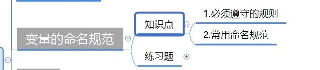
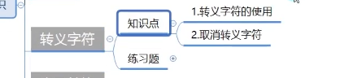

# 基础的语法和常用api的一些函数

- `Console.Writeline`是打印一行并自动空行，注意区分它和`Console.Write`的区别。
- `Console.Readline()`检测控制台输入，回车键结束。
- `Console.ReadKey()`检测玩家是否按键，只要按下键盘任意键就会输入结束。
- 使用`Console.WriteLine()`进行拼接打印变量时要小心变成加法

```c#
int sheng = '沈';
int yu = '宇';
int hao = '镐';
Console.WriteLine(sheng + yu + hao);	//输出的会是字符的ASCAII码值的加法
Console.WriteLine("打印的名字是："+sheng+yu+hao);		//输出的会是每个字符的ASCAII码值，需要先确定构造函数的重载。
```

- 在读长代码时，要先注意括号内的内容。
- 使用for循环求范围时，如1~100的范围，那么初始表达式和条件表达式常用的写法是`int i=0;i<100;i++`或`int i=1;i<=100;i++`使用后者更符合直觉，但是使用前者则更利于数组的计算和使用。==所以在实际使用时，当题目给定的是数值范围时，更适合使用`int i =1;`的写法，而当题目设计到下标和数组时，则更适合`int i=0`的写法。
- 

---


---

# 变量


---

## 折叠代码：

配对出现，可以将中间包裹的代码折叠避免代码凌乱，方便观察整个代码的逻辑结构。

本质是编辑器提供的预处理指令，只有在编辑代码时才产生作用。

```c#
#region MyRegion	
#endregion
```

## 如何申明变量

- 变量类型有14种变化
- 变量名 自定义 但要按照一定的规则
- 初始值 一定要和变量类型是统一的
- = 和；是固定不变的

通过`+`进行拼接打印

修改变量值不需要前缀再写变量类型 否则会报错重复声明

### 变量类型

- **有符号的整型变量** 能存储 一定范围 正负数包括0的变量类型	
  - sbyte -128~127
  - int -21亿~21亿多
  - short -32768~32767之间的数
  - long -9百万兆~9百万兆之间的数

- **无符号的整型变量** 能存储 一定范围 0和正数的变量类型

  - byte 0~255
  - uint 0~42亿多的范围
  - ushort 0~65535之间的数
  - ulong 0~18百万兆之间的数

  可以注意**u关键字**方便记忆

-  **浮点数（小数）** 

  - **float** 7~8位的有效数字 根据编译器不同 有效数字也可能不一样 四舍五入 **后缀必须加f** 从左到右非0数开始算有效数字的 `float f = 1.0123456789f` 在控制台中打印的结果为：`1.0123456`

  - **double**  存储15~17位有效数字 。c#中声明小数默认是double类型，加f 告诉系统它是float类型

  - **decimal** 存储27~28位有效数字 不建议使用 声明时需要是用后缀 **m**

    `decimal de =0.1211154654654645456464465645m;`

- **特殊类型**

  - **bool** true false 表示真假的数据类型
  - **char** 用来存储单个字符的变量类型
  - **string** 用来存储多个字符 没有上限 使用英文的双引号

## 为什么有那么多不同的变量类型

- 不同的变量 存储的范围和类型不一样 本质时占用的内存空间不同
- 选择不同的数据（变量）类型装载不同的数据

## 变量初始化相关

- 声明时可以不设置初始值 但不建议这样写 这样不安全

## 变量练习题


---

# 变量的本质

大纲：


- 通过`size of`方法获取变量类型所占的内存空间。（单位字节）

## 变量的存储空间

有符号：

- **sbyte** 1byte
- **int** 4bytes
- **short** 2bytes
- **long** 8bytes

---

无符号：

- **byte** 1byte
- **uint** 4bytes
- **ushort **2bytes
- **ulong** 8bytes

---


浮点数：

- **double** 8bytes
- **float** 4bytes

- **decimal** 16bytes


特殊：

- **bool** 1byte
- **string** 无法通过sizeof获取所占内存空间大小，因为string的内存空间是动态分配的
- **char** 2bytes 

## 变量的本质 2进制

- 使用除2取余法将10进制转换为2进制。（除2取余结果倒取）

- 2进制转10进制，从右往左看 最右边的第一位为第0位，如果该位不为0 则加上2的n位次方。

- 对于有符号的数来讲 二进制左边第一个位是符号位，这就是为什么sbyte和byte的大小都是一个字节但sbyte的范围是-128~127而byte的范围是0～255

> 这是因为在计算机中，使用二进制补码来表示有符号整数。在一个字节（8位）中，最高位用于表示符号，0表示正数，1表示负数。因此，一个字节能够表示的有符号整数范围为-2^7（-128）到2^7-1（127），其中一个比特用于表示符号，另外七个比特用于表示数值。
>
> 如果使用-127～127的范围，那么就会出现一个问题，即没有办法表示-128，因为在二进制补码中，-128的表示方法是10000000，也就是最高位为1，其余位为0。如果将最高位用于表示符号，那么就无法表示-128了。因此，为了能够表示-128，需要将最高位也用于表示数值，这就导致了有符号整数范围为-128~127。

# 变量的命名规范



## 必须遵守的规则

- 不能重名
- 不能以数字开头
- 不能使用程序关键字命名
- 不能用特殊符号（下划线除外）

建议的命名规则：变量名要有含义->用英文（拼音）表示变量的作用

不建议用汉字命名

## 常用命名规则

- 驼峰命名法——首字母小写，之后单词首字母大写（变量）
- 帕斯卡命名法——所有单词首字母大写（函数、类）

c#中对大小写是敏感的。

---

# 常量


主要用来形容一些数学定理或者公理性质的变量 用来参与计算的变量

## 常量的声明：

- 关键词const
- 固定写法：const 变量类型 变量名 = 初始值。

## 常量的特点：

- 必须初始化
- 不能被修改
- 和静态对象有相似之处

# 转义字符



## 转义字符的使用

- 固定写法 \字符
- 不同的 \和字符的组合 表示不同的含义

### 常用转义字符

- **单引号** 

```
\`字符\`
```


- **双引号**`\"字符"\`

```
\"字符\"
```

​	如果直接`““字符”"`的话会报错

- **换行**

`\n`

- **斜杠**

使用双斜杠在字符串中将斜杠转为转义字符

​	`str = “哈\\哈哈”;` 输出结果为：**哈\哈哈**

- 制表符（空一个tab键）

​	`\t`

- 光标退格(会把光标的位置往前退一格再开始打印)

​	`\b`

- 空字符

​	`\0`

- 警报音

​	`\a`

## 取消转义字符

使用关键词`@`可以取消转义字符的作用：

`string str2 = @“哈哈\哈哈”;`

使用**@**之后就不会产生报错

# 类型转换


## 隐式转换

**规则总结：**高精度（大范围）装低精度（小范围）

- double——>float——>整数（无符号、有符号）——>char
- decimal ——> 整数（有符号、无符号）——>char
- string 和 bool不参与隐式转换规则

### 1.相同大类型之间的转换

- 隐式转换的基本规则——>不同类型之间自动转换
- 大范围转小范围

小范围转大范围会报错。

==浮点型中的decimal 和double和float类型的转换不能使用隐式转换的方式== 

float类型可以隐式转换成double类型

```c#
double d=1.1;
float f = 1.1f;
d = f;
```

- 特殊类型 **bool char string**之间不存在隐式转换

### 2.不同大类型之间的转换

#### 有符号和无符号之间的转换

- 无符号装有符号无法进行隐式转换。
- **有符号装无符号需要优先考虑容器大小**。==如果有符号的数的范围大于无符号的数的范围则可以进行隐式转换==，但如果是同级的有符号数的范围是无符号数的范围的1/2

#### 浮点数和整数（有、无符号）之间的转换

- 浮点数 **可以装载任何类型的整数** 同时浮点数在赋值整数时可以装载超过其有效数字的整数用科学计数法进行表示。

```c#
float f2;
long l2;
ulong i2;
f2 = l2;
f2 = i2;
f2 = 10000000000000000000000000；
Console.WriteLine(f2);
```

输出的结果为：


- ==虽然decimal不能够隐式存储float和double类型，但是可以隐式存储整型。==

- 整数不能隐式存储浮点数类型，因为整数不能存小数。

#### 特殊类型和其它类型之间

- 布尔类型无法和其它类型相互隐式转换
- char类型也没有办法隐式存储其它类型的变量。==但是char类型可以隐式的转换成int型和浮点数类型==

char隐式转换成数值类型时，对应得数字 其实时一个ASCII码

- string类型无法和其它类型进行隐式转换

## 显示转换


### 括号强转

**作用：一般情况下 将高精度的类型强制转换为低精度**

**语法：变量类型 变量名 = （变量类型）变量；**

**注意： 精度问题 范围问题**

括号强转可能会出现范围问题造成的异常（溢出时出现）

==使用浮点数类型之间的括号强转在数据溢出的时候不会造成异常只会丢失精度==

==无符号强转为有符号时可能会出现数据异常==

**浮点和整型的强转：**

规则是向下取整。

**char和整型的强转：**

从ASCAII码值重新转换为字母

==bool和string不能通过括号的形式进行强转==

### Parse法

**作用：**把字符串类型转换为对应的类型

**语法：**变量类型.Parse(“字符串”)

**注意：**字符串必须能够转换成对应类型 否则报错

```c#
int i4 = int.Parse("123");
Console.WriteLine(i4);
```

==注意：如果字符串不能转换成对应类型就会报错==

```c#
int i4 = int.Parse("123.45");
Console.WriteLine(i4);	//结果会产生报错
```

==同样的，如果转换类型的范围与字符串的范围不一致也会产生报错==

```c#
short s3 = short.Parse("40000000000000");
Console.WriteLine(S3);	//结果会产生报错
```

 **特殊类型的Parse转换也必须满足字符串的值必须在被转换类型的范围内的规则**：

```c#
bool b = bool.Parse("true");
Console.WriteLine(b);

char c2 = char.Parse("A");	//只能存一个字符
Console.WriteLine(c2);
```

==string 不存在Parse方法==

### Convert法

**作用：**更准确的将 各个类型之间进行相互转换

**语法：**Convert.To目标类型（变量或常量）

**注意：**填写的变量或常量必须正确 否则出错

==如果把字符串转对应类型 字符串必须合法合规==

**每个类型都存在对应的Convert中的方法**

```c#
int a = Convert.ToInt32("12"); //32代表的是位数，如果是长整型则为8*8=64位
```

**==使用convert将浮点数转换为整数时，它的精度更高，所以会采用四舍五入的方法==**

**使用convvrt也能够将bool类型强转为数值类型**，而括号强转的方法是做不到这点的。

其中float和bool在Convert方法中的表达相对特殊：

```c#
float f5 = Convert.ToSingle("12.343");

bool bo5 = Convert.ToBoolean("true");
```

### 其它类型转string

**作用**：拼接打印

**语法**：变量.toString();

```c#
string str6 = 1.ToString();
str6 = true.ToString();
str6 = 'A'.ToString();
str6 = 1.2f.ToString();

//当进行字符串拼接时，会自动调用tostring转换成string类型
Console.WriteLine("123123"+1+true);
```

---

# 异常捕获

## 1、作用

避免当代码报错时 造成程序卡死的情况

## 2、基本语法

```c#
//必备部分
try
{
	//希望进行异常捕获的代码块
    //放到try中
    //如果try中的代码报错 不会让程序卡死
}
catch	//必须和try配对使用
{
	//如果出错了 会执行 catch中的代码，来捕获异常
    //catch(Exception e)	具体报错跟踪 通过e得到 具体的错误信息
}
//可选部分
finally
{
    //不管有没有出错，都会最终执行的代码
}
```

---

# 基本运算符

## 算数运算符

等号的左边往往是单个变量，复杂的计算式往往是在右侧。

#### 1.赋值符号

- 先看右侧 再看左侧 把右侧的值赋值给左侧的变量

```c#
int myAge = 22;		//先看等于号的右侧
```

#### 2.算数运算符概念

##### ＋：

- 自己计算，先算右侧结果，再赋值给左侧的变量

  ```c#
  int i =1;
  i = i+2;
  ```

- 连续运算，先算右侧结果，再赋值给左侧变量

  ```c#
  i = 1 + 3 + 89 +i + i;
  ```

- 初始化时就运算 先算右侧结果 再赋值给左侧变量

  ```c#
  int i2 = 1+2+4+i;		//即在声明时就进行计算
  ```

##### -：规则类似

##### *：

##### ÷：

注意整除的计算是向下取整，如果想用浮点数来存储，在运算时要有浮点数的特征。

##### %（取余）：


使用的规律基本都是先计算右侧，再将其赋值给左侧的变量。 


#### 3.算术运算符的优先级


- ==同一优先级的算术运算从左到右进行计算，比如乘除取余==
- 括号可以改变优先级
- 多组括号，先算最里层的括号，依次往外算

#### 4.算术运算符的 复合运算符

- 固定写法 运算符=

​		+= -= *= /= %=

​		用于 自己=自己的进行运算

```c#
i3 += 2;	//i3 = i3 +2;
```

复合运算符不能进行混合运算： i */-=2 这样是错误的。

#### 5.算数运算符的自增减

`a++`先用再加`++a`先加再用。

## 字符串拼接

#### 通过加号进行字符串拼接：

```C#
string str ="123";
str = str +"456";

str = str +1;	//默认会调用1.tostring()，将1转为字符串
```

- 可以使用复合运算符进行拼接：

==注意==：

```c#
str += 1+2+3+4;
//在这个式子中先计算右侧再加到左侧，右侧会先进行整型运算，再将其化为字符串的形式和str拼接
```

要避免这种情况：

```c#
str += "" +1 +2 +3 +4;	//加入一个空字符串后规则改变
```

还有一种情况：

```c#
str += 1+2+""+3+4;	//按照前面的规则，最终打印的结果为：334
```

**也可以通过()改变运算顺序，使字符串后的数据先计算再拼接。**

```c#
str +=1+2+""+(3+4);	//最终的结果为37
```


==字符串拼接只能使用 +号进行拼接，不能使用-*÷==

#### 拼接方式2

固定语法：`string.Format(“待拼接的内容”,内容1,内容2,…….);`

拼接内容中的固定规则：想要被拼接的内容用占位符替代{数字} 数字：0~n 依次往后。

```c#
string str2 = string.Format("我是{0},我今年{1}岁，我想要{2}","吃猫的鱼",18,"学习做游戏");
Console.WriteLine(str2);
```


#### 控制台打印拼接：

语法示例：

```c#
Console.WriteLine("A{0}B{1}C{2}",1,true,false);
```

与方法2类似，**要注意的是后面的参数比占位符多，不会报错，但如果后面的内容少于占位符则会报错**。

#### 复习案例：


## 条件运算符

条件运算符 一定存在左右两边的内容

左边内容 条件运算符 右边内容

`bool result = a>= b;`

- 条件运算符的优先级低于算数运算符

- 条件运算符不能进行范围比较

  `1<a<6`不能在主流语言中这样写。

- 不同数值类型之间，可以随意进行条件运算符比较

  ```c#
  int i =5;
  float f=1.2f;
  double d=12.4;
  short s=2;
  byte by=20;
  
  //主要是数值类型就能够进行条件运算符比较
  result = i>f;
  result =f<d;
  result = i>by;
  
  ```

- 特殊类型 char string bool 只能同类型进行 == 和！=比较

- char 可以和 数值进行比较，会自动将char的字母转换为对应的ASCII码

  

## 逻辑运算符


### 1.逻辑与


### 2.逻辑或


### 3.逻辑非


**逻辑非的优先级较高**，**但是依旧低于括号的优先级**。

### 4.混合使用优先级问题


== 逻辑与的优先级高于逻辑或==

```c#
bool A,C,D,result;
int B = 3;
result = A|| B<2 && !C || D;
Console.WriteLine(result);
```

### 5.逻辑运算符的短路规则

有真则真，只要逻辑与或者逻辑或满足了左边的条件，则右边的条件会被略过，即如果右边出现自增运算符会无效。

## 位运算符


==多个变量进行位运算符计算时如果没有括号要从左往右进行计算，不能进行一次性的比较。==

#### 1.位与&


**前方不够则补0**，有0则0

#### 2.位或|


**有1则1**

#### 3.异或^


**相同为0不同为1**

#### 4.位取反

int是32位的二进制数，所以使用~取反要将所有二进制位写出来进行取反：


**最终输出的致为-6**

#### 5.左移<< 和右移>>


左移是整体数据往左边移动所以会变大，而不是基准线左移。

右移的规则与左移类似，**右移几位，右侧就去掉几个数**

## 三目运算符


第一个空位 始终是结果为bool类型的表达式 bool变量 条件表达式 逻辑运算符表达式。

# 条件分支语句

## 条件分支语句——if

要注意的是语句块会影响变量的生命周期。

## 条件分支语句——switch


常量只能写一个值，不能写一个范围或者条件运算符，逻辑运算符这些。

**case 后可以使用常量变量**

#### 贯穿：

作用：满足某些条件时，做的事情是一样的，就可以使用贯穿。


不写case后面配对的break就叫做贯穿满足1，3，4，2其中一个条件就会执行之后的代码。

switch里面也可以继续嵌套if和switch语句。

# 循环语句

## while

#### 1.作用

#### 2.语法相关

#### 3.嵌套使用

#### 4.流程控制关键词


- continue：


==要注意的是break和continue主要是和循环配合使用，和if语句无关，break在swithc中的作用和while循环中的作用有异曲同工之妙==

**当break出现在嵌套在while语句中的switch语句中时，break只对switch语句产生作用，而当continue出现在while语句中时，continue不会对switch语句产生作用，而直接作用于switch语句外的while循环。**


## do…while

- 先判断条件再执行
- do while循环 先斩后奏 先至少执行一次循环语句块中的逻辑 再判断是否继续。

break可以正常跳出do while循环，**而continue语句则是会跳转到while()这部分条件判断的地方**


可以使用bool变量制作标签。

## for

#### 基本语法：

固定的格式是不变的，必须是两个分号间隔。


#### 支持嵌套：

#### 特殊写法：

for可以写死循环：

```c#
for( ; ;)
{
	Console.WriteLine("for循环的死循环");
}
```

```c#
int k =0;
for(; k<10;)
{
	++k;
}
```

```c#
for(k=0; ; ++k)
{
	if(k>=10)
	{
		break;
	}
}
```

#### 对比while循环

for循环更多是计数。==一般用来可以准确得到 一个范围中的所有数==


# c#入门实践项目：

## 大纲和思维导图：


### 2.控制台基础设置

````c#
Console.CursorVisible = false;
            int w = 50, h = 30; //通过两个变量来存储舞台的大小
            Console.SetWindowSize(w, h);
            Console.SetBufferSize(w, h);
````

### 3.多个场景

实现三个场景，开始界面，游戏界面，结束界面，要实现场景切换的效果。


### 4.开始场景的逻辑实现

#### (1).不变的红墙

#### (2).Boss相关

#### (3).主角移动相关

#### (4).主角和Boss战斗

#### (5).营救公主

### 5.游戏场景逻辑实现

### 6.结束场景逻辑实现

流程图总结：


