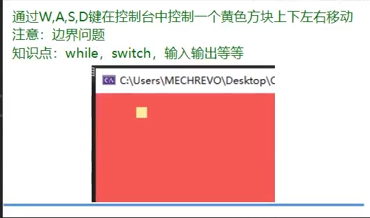
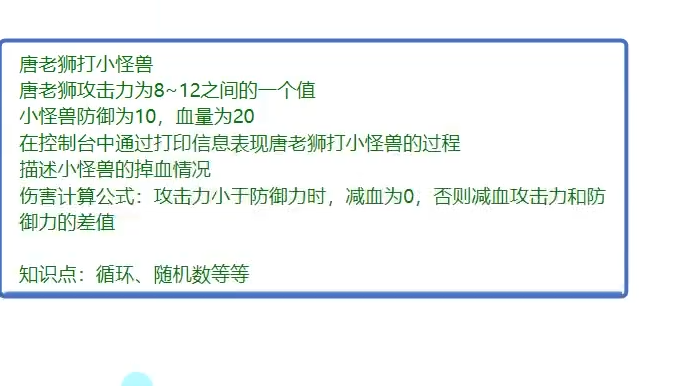
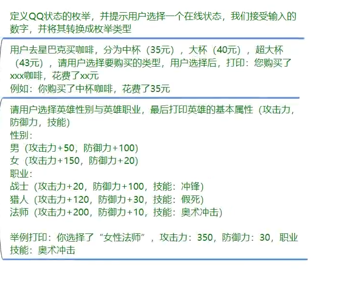
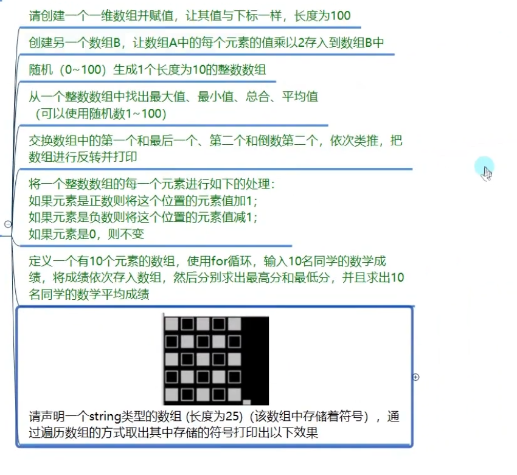
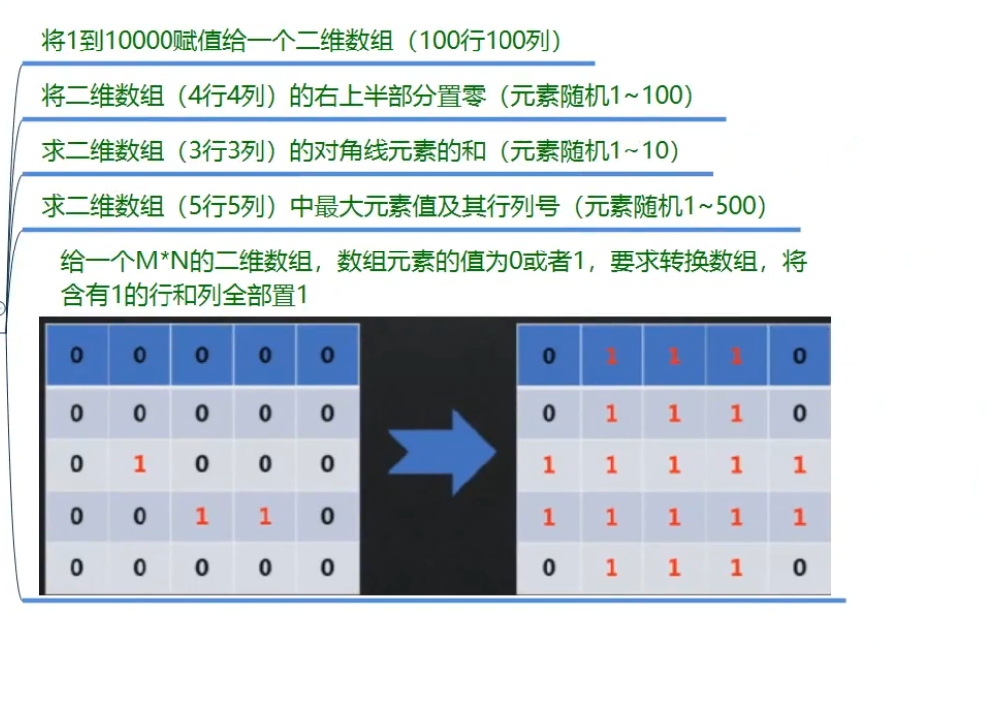
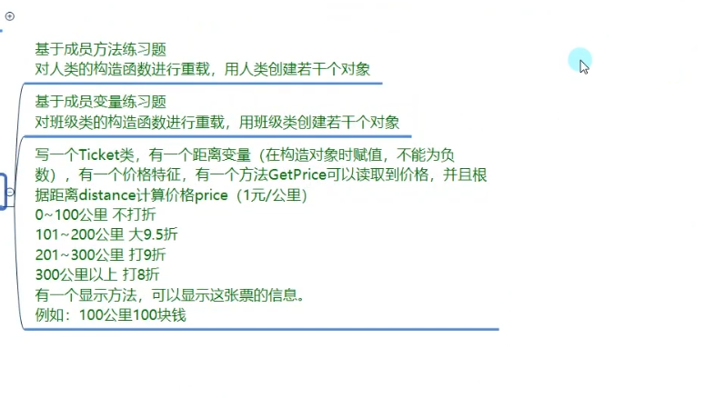
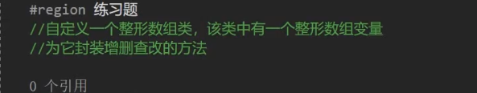

# c#入门：

### for循环练习题：

```c#
//只用for循环输出:
//*****************
//*               *
//*               *
//*               *
//*               *
//*               *
//*               *
//*               *
//*               *
//*****************

			/*核心代码*/
			/*单循环*/
			for (int i = 1; i <= 10; i++)
            {
                if (i == 1 || i == 10)
                {
                    Console.WriteLine("**************");
                }
                else
                {
                    Console.WriteLine("*            *");
                }
            }
            /*使用双重循环*/
            for (int i = 1; i <= 10; i++)
            {
                for (int j = 1; j <= 10; j++)
                {
                    if (i==1||i==10)
                    {
                        Console.Write("*");
                    }
                    else
                    {
                        if (j==1||j==10)
                        {
                            Console.Write("*");
                        }
                        else
                        {
                            Console.Write(" ");
                        }
                    }
                }
                Console.WriteLine();
            }
```

### 控制台练习题：



```c#
using System;

namespace 控制台测试
{
    class Program
    {
        static void Main(string[] args)
        {
            
            Console.BackgroundColor = ConsoleColor.Red;
            Console.Clear();
            Console.CursorVisible = false;

            Console.ForegroundColor = ConsoleColor.Yellow;
           

            int x = 0, y = 0;
           
            while (true)
            {
                //Console.Clear();  //会造成闪屏所以不采用这个方式清空移动的痕迹
                Console.SetCursorPosition(x,y);
                Console.Write("■");
                char key = Console.ReadKey(true).KeyChar;
                /*通过打印空格清空移动的痕迹*/
                Console.SetCursorPosition(x, y);
                Console.Write("  ");    //这里需要两个空格
                switch (key)
                {   
                    //贯穿
                    case 'W':
                    case 'w':
                        y -= 1 ;
                        //改变位置之后判断新位置是否越界
                        if (y<0)
                        {
                            y = 0;
                        }
                        break;
                    case 'A':
                    case 'a':
                        x -= 2; //中文符号占两个空位
                        if (x < 0)
                        {
                            x = 0;
                        }
                        break;
                    case 'S':
                    case 's':
                        
                        y += 1;
                        //判断缓冲区的高，不越过边界。
                        if (y>Console.BufferHeight - 1)
                        {
                            y = Console.BufferHeight;
                        }

                        break;
                    case 'D':
                    case 'd':
                        x += 2;
                        if (x > Console.BufferWidth -2)
                        {
                            x = Console.BufferWidth-2;
                        }
                        break;
                    default:
                        break;
                }
                
            }
            
        }
    }
}

```

要注意的是边界溢出问题和打印的■实际的坐标位置是左下角的小点（并且x=2，y=1）。

### 随机数练习题：



```c#
using System;

namespace 随机数练习
{
    class Program
    {
        static void Main(string[] args)
        {
            int myAtk = 0;
            int monsterDef = 10, monsterHp = 20;
            Random r = new Random();


            while (true)
            {
                myAtk = r.Next(8, 13);
                if (monsterHp > 0)
                {
                    if (myAtk > monsterDef)
                    {
                        monsterHp -= myAtk - monsterDef;
                        Console.WriteLine("本次攻击造成{0}伤害，怪物剩余{1}HP", myAtk - monsterDef, monsterHp);
                    }
                    else
                    {
                        Console.WriteLine("本次攻击不破防");
                    }
                    Console.WriteLine("请按任意键执行下一次攻击");
                    Console.ReadKey(true);
                    

                }
                else
                {
                    Console.WriteLine("怪物已经被击杀");
                    Console.ReadKey();
                    break;
                }


            }
        }
    }
}

```


# C#基础

### 枚举练习题：



## 数组练习题：



## 二维数组练习题：



# c#核心

## 构造函数和析构函数练习题：



## 索引器练习题：


