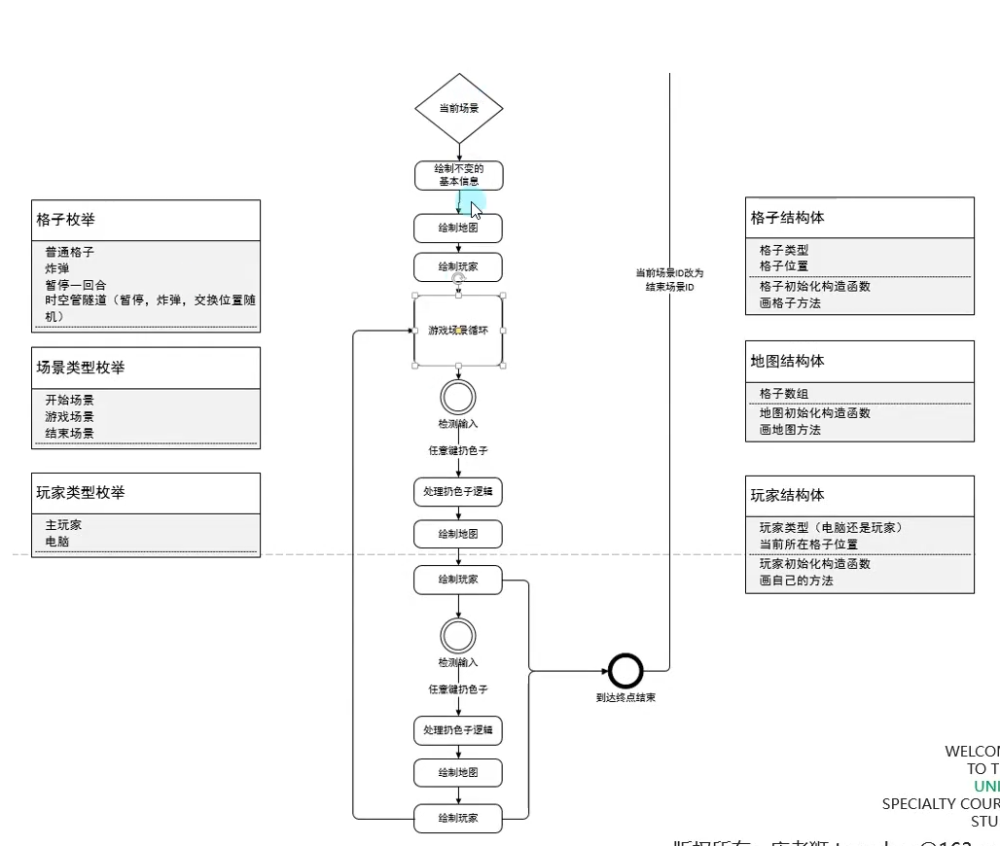

## 该部分涉及到的一些语法和技巧：

- ==三杠注释的作用==：`///`


用于解释说明，可以作用于类、接口、枚举但不能注解。

---


# 大纲


---

# 复杂数据类型

## 概述

复杂数据类型特点：

1.数据集合：一般是多个数据（变量）集合在一期构成的数据

2.自定义：一般可以自己取名字，可以自定义的数据（变量）

## 枚举（整型常量的集合，可以自定义）

### 1.基本概念

**(1).枚举是什么**

枚举是一个被命名的整型常量的集合

一般用它来表示状态、类型等等

**(2).申明枚举和申明枚举变量的区别**

申明枚举： 相当于是 创建一个自定义的枚举类型

申明枚举变量： 使用申明的自定义枚举类型，创建一个枚举变量

**(3).申明枚举语法**

`enum`是申明枚举的关键字

```c#
enum E_自定义枚举名
{	
    自定义枚举项名字，	//枚举中包裹的，整型常量，第一个默认值为0，下面会依次累加
    自定义枚举项名字1，
    自定义枚举项名字2，
}
```

```c#
enum E_自定义枚举名
{	
    /*在新赋值的基础上进行累加*/
    自定义枚举项名字 = 5，	//如果主动去设定第一个枚举项的值
    自定义枚举项名字1，//6
    自定义枚举项名字2 = 100，//再次设定新的默认值
    自定义枚举项名字3，	//101
    自定义枚举项名字4，	//102
}
```

### 2.在哪里声明枚举

**(1)**.在namespace语句块中(常用)

**(2).**class语句块中，struct语句块中也可以声明

**(3).****枚举不能在函数语句块中声明！！！**

### 3.枚举的使用

```c#
/* 在namespace中声明枚举 */
enum E_MonsterType
{
    //使用帕斯卡命名法去命名枚举
	Normal,	//0
    Boss,	//1   
}
enum E_PlayerType
{
    Main,
    Other,
}

```

```c#
/* 声明枚举变量 */
//自定义枚举类型 变量名 = 默认值;(自定义的枚举类型.枚举项)
E_PlayerType playerType = E_PlayerType.Main;

if(playerType == E_PlayerType.Main)
{
    Console.WriteLine("主玩家逻辑");
}
else if(playerType == E_PlayerType.Other)
{
    Console.WriteLine("其它逻辑");
}
```

==枚举和switch天生一对==

当把枚举变量作为switch中的变量时，IDE会自动补全剩余的逻辑处理


### 4.枚举的类型转换

**(1).枚举和int互转**(括号强转)

`int i =(int)playerType;`

int 转枚举

`playerType = 0;`

**(2).枚举和string互转**

`string str = playerType.ToString();` ==打印的会是枚举项的名字：main==

---


parse后第一个参数：你要转为的是那个枚举类型 第二个参数：用于转换对应枚举项的字符串，转换完毕后是一个通用的类型，需要用括号强转成我们想要的类型。

`playerType = (E_PlayerType)Enum.Parse(typeof(E_PlayerType),”Other”);`

### 5.枚举的作用

在游戏开发中，对象很多时候会有许多的状态，比如玩家有一个动作状态，我们需要用一个变量或者标识来表示当前玩家处于的是哪种状态，综合考虑，可能会使用int来表示他的状态

如：1.行走 2.待机 3.跑步

==而枚举最大的作用是可以帮助我们清晰的分清楚状态的含义，提升代码的可读性==

## 数组（任意变量类型顺序存储的数据）

用来批量存储游戏中的同一类型对象的**容器**，比如所有的怪物，所有玩家。

### 一维数组

#### 1.基本概念

数组是存储一组相同类型数据的集合

数组分为一维、多维、交错数组

一般情况，一维数组就简称为数组

#### 2.数组的声明

```c#
/*第一种*/
变量类型[] 数组名;	//只是声明了一个数组，但没有在内存中开辟空间
int[] arr1;		 		//变量类型，可以是我们学过的或者没学过的所有变量类型
/*第二种*/
变量类型[] 数组名 = new 变量类型[数组的长度];	//开辟了能够存放5个变量的内存空间
int[] arr2 = new int[5];	//内存空间中int的默认值为0
/*第三种*/
变量类型[] 数组名 = new 变量类型[数组的长度]{内容1，内容2，内容3，.....};
int[] arr2 = new int[5]{1,2,3,4,5};	//长度是多少就需要填入多少数据，否则会报错，如果超出数组则会被省略
/*第四种*/
int[] arr2 = new int[]{1,2,3,4,5};	//后面的内容决定了数组的长度
/*第五种*/
变量类型[] 数组名 ={内容1，内容2，内容3，......};
int[] arr2 = {1,2,3,4,5};	//数组类型决定了存放数据的类型
```

#### 3.数组的使用

##### (1).数组的长度

通过数组变量名.Length获取数组的长度

`Console.WriteLine(array.Length);`

##### (2).获取数组中的元素

 `Console.WriteLine(array[0]);`

通过索引下标去获得数组中某个元素的值时，一定注意

==不能越界==

==数组的范围时 0~Length-1==

##### (3).修改数组中的元素

`array[0] = 99;`重新赋值。

##### (4).遍历数组

```c#
for(int i =0;i<array.Length;i++)
{
	Console.WriteLine(array[i]);
}
```


通过循环快速获取数组中的每一个元素

##### (5).增加数组中的元素

**数组初始化以后不能直接添加新的元素**

```c#
/*数组搬家*/	//可以将数组类比为旅馆，当定了旅馆后就不能随意更改入住的人数
int[] array2 = new int[6];
for(int i =0;i<array.Length;i++)
{
	array2[i]=array[i];
}
array =array2;	//使原有数组指向新的数组
```

##### (6).删除数组中的元素

**数组初始化后也不能够直接删除元素**

```c#
int[] array3 = new int[5];
for(int i =0;i<array3.Length;i++)
{
	array3[i]=array[i];		//只搬运前五个元素
}
array= array3;
```

##### (7).查找数组中的元素

假设有 99 2 3 4 5这5个元素

要查找3这个元素在哪个位置。

==没有捷径可走==

**只有通过遍历才能确定数组中是否存储了一个目标元素**

```c#
int a= 3;
for(int i= 0;i<array.Length,i++)
{
	if(a == array[i])
	{
		Console.WriteLine("和a相等的元素在{0}的位置",i);
		break;
	}
}
```

### 二维数组

同一变量类型的 行列数据集合

**一定要掌握得内容：声明，遍历，增删查改**

所有的变量类型都可以声明为二维数组

==在游戏中一般用来存储矩阵，在控制台小游戏中可以用二维数组来表示地图格子==


#### 基本概念

二维数组是使用两个下标（索引）来确定元素的数组

两个下标可以理解成行标和列标

比如矩阵

1 2 3

4 5 6 

可以用二维数组int[2,3]表示

好比 两行 三列的数据集合

#### 二维数组的声明

```c#
/*第一种*/
变量类型[,] 二维数组变量名;
int[,] arr;	//声明后会在后面进行初始化
 /*第二种*/
变量类型[,] 二维数组变量名 = new 变量行[行，列];
int[,] arr2 = new int[3,3];
/*第三种*/&&/*第四种*/
int[,] arr3 = new int[2,2]{{1,2,3},	//int[,]
                         {4,5,6}};	
/*第五种*/
int[,] arr4 = {{1,2,3},
               {4,5,6},
               {7,8,9}};
```

#### 二维数组的使用

==要注意行和列都是从0开始的==

##### (1).二维数组的长度

一维数组的长度可以直接通过`array.Length`获得，二维数组比较特殊

只能分别获取二维数组的行数和列数

固定语法：

```C#
Console.WriteLine(array.GetLength(0));	//得到多少行
Console.WriteLine(array.GetLength(1));	//得到多少列
```


##### (2).获取二维数组中的元素

第一个元素的索引是0 最后一个元素的索引 肯定是长度-1;

```
Console.WriteLine(array[0,1]);	第0行第一列
```

##### (3).修改二维数组中的元素

##### (4).遍历二维数组中的元素

```c#
for(int i = 0;i<array.GetLength(0);i++)
{
	for(int j =0;j<array.GetLength(1);j++)
	{
		Console.WriteLine(array[i,j]);
	}
}
```

##### (5).增加数组的元素

数组声明初始化后，就不能在原有的基础上进行添加或者删除了 

```c#
int[,] array2 = new int[3,3]
for(int i = 0;i<array.GetLength(0);i++)
{
	for(int j =0;j<array.GetLength(1);j++)
	{
		array2[i,j] =array[i,j];
	}
}
array = array2;
array[]
```

##### (6).删除数组的元素

##### (7).查找数组的元素

如果要在数组中查找一个元素是否等于某个值，一定是通过遍历的形式去查找。 

### 交错数组（非重点）

#### 基本概念

交错数组是数组的数组，每个维度的数量可以不同

注意：二维数组的每行的列数相同，交错数组每行的列数可能不同

#### 数组的声明

```c#
 /*第一种*/ 
 int[][] arr1;zhi
 /*第二种*/
//变量类型[][] 交错数组名 =new 变量类型[行数][];
int[][] arr2 = new int[3][];	//第二个括号需要空出，第一个括号代表行数
/*第三种*/
//变量类型[][] 交错数组名 = new 变量类型[行数][]{一维数组1，一维数组2，.......};
int[][] arr3 = new int[3][]{new int[]{1,2,3},
                           new int[]{1,2},
                           new int[]{1}};
/*第四种*/
int[][] arr4 = new int[][]{new int[]{1,2,3},	
                           new int[]{1,2},
                           new int[]{1}};	//省略行
/*第五种*/
int[][] arr5 = {new int[]{1,2,3},	
                new int[]{1,2},
                new int[]{1}};
```

#### 数组的使用

```c#
int[][] array = {new int[]{1,2,3},
				 new int[]{4,5}};
```

##### (1).数组的长度

```c#
Console.WriteLine(array.GetLength(0));	//得到行数
Console.WriteLine(array[0].Length);		//得到某一行的列数
```

##### (2).获取交错数组中的元素

注意不要越界

```c#
Console.WriteLine(array[0][1]);
```

##### (3).修改交错数组中的元素

##### (4).遍历交错数组中的元素

```c#
for(int i = 0;i<array.GetLength(0);i++)
{
	for(int j =0;j<array.[i].Length;j++)
	{
		Console.WriteLine(array[i][j]);
	}
}
```

##### (5).增加交错数组的元素

##### (6).删除交错数组的元素

##### (7).查找交错数组的元素

# 值类型和引用类型

### 变量类型的复习

**1.无符号整型**

byte、ushort、uint、ulong；

**2.有符号整型**

sbyte、short、int、long

**3.浮点数**

float、double、decimal

**4.特殊类型**

bool、string、char

**5.复杂数据类型**

enum、数组（一维、二维、交错）


==以上类型中引用类型：string、数组、类==（string是特殊的引用类型）

值类型：其它、结构体

## 使用和存储上的区别

#### 1.使用上的区别

值类型：

int a=10；

引用类型

int[] arr=new int[]{1,2,3,4};

int b =a;

int[] arr2 =arr;

**值类型 在相互赋值时 把内容拷贝给了对方 它变我不变**

**引用类型的相互赋值 是让两者指向同一个值 它变我也变**

#### 2.为什么有以上区别

值类型 和 引用类型 存储在的 内存区域是不同的 存储方式是不同的，所以造成了他们在使用上的区别

==值类型存储在 栈空间 ——系统分配，自动回收，小而快==

 


==引用类型存储在堆空间——手动申请和释放，大而慢==


**容易产生误解的**


string是一个特殊的引用类型，不遵循它变我也变

## 特殊的引用类型string

string是它变我不变

==c#对string进行过特殊处理，它具备值类型的特征，它变我不变==


**如果频繁的改变string类型重新赋值，会产生内存垃圾。**


通过`&`观察debug栈内存上的地址 

```c#
string str1 =“123”;

string str2 =str1;	//在这个过程中，str2没有在栈上开辟的内存空间指向的是str1的地址，而如果是值类型，则是直接将值存储在栈上

str2 =“321”;
Console.WriteLine(str1);
Console.WriteLine(str2);
```

# 函数

## 函数基础

### 知识点一 基本概念

函数的本质是一种具有名称的代码块，可以使用函数（方法）的名称来执行该代码块，函数（方法）是封装代码进行重复使用的一种机制

**主要作用：**

1.封装代码

2.提升代码复用率

3.抽象行为

### 知识点二 写在哪里

1.class语句块中

2.struct语句块中

### 知识点三 基本语法

```c#
static 返回类型 函数名(参数类型 参数名1,参数类型 参数名2,......)
{
    函数的代码逻辑
    
    return 返回值;	//可选，如果有返回类型才返回
    
}
//关于static，不是必须的，在没有学习类和结构体之前，都是必须写的
//void 代表没有返回值。
//返回乐享可以写任意的变量类型 14种变量类型+复杂数据类型（数组、枚举、结构体、类class)
```

==关于函数名，需要使用帕斯卡命名法命名 MyName（帕斯卡命名法）==

参数不是必须的，可以有0~n个参数，参数的类型也可以是任意类型的

多个参数需要用逗号隔开

参数名的命名规范还是按照驼峰命名法。

当返回值类型不是void时，必须通关新的关键词return返回对应类型的内容（注意：即使时void也可以选择性使用return)

### 知识点四 实际运用


==有参有多返回值函数==

传入两个数，然后计算两个数的和，以及他们的平均数，得出结果返回出来

函数的返回值， 一定时一个类型 只能是一个内容

```c#
static int[] calc(int a,int b)
{
    int sum =a+b;
    int avg=sum/2;
    //int[] arr={sum,avg};
    //return arr;
    return new int[]{sum,avg};	//必须先声明这是一个数组
}
```

**如果是用数组作为返回值出去，那么前提是使用者知道这个数组的规则**

### 知识点五 关于return

==即使函数没有返回值，也可以使用return==

==return可以直接不执行之后的代码，直接返回到函数的外部==


## ref和out

**ref和out的使用**

ref和out关键词的使用都是在变量的前面

### ref

1.函数参数的修饰符

当传入的值类型参数在内部修改时，或者引用类型参数不在内部重新声明

外部的值会发生变化

```c#
static void ChangeValueRef(ref int value)	//类似于c++的指针
{
	value =3;
}
//在使用时需要在变量前面加上ref关键字
ChangeValueRef(ref a);
Console.WriteLine(a);
```

### out

在声明和使用上几乎和ref一样

### ref和out的区别

==1.ref传入的变量必须初始化，out不用==

```c#
Console.WritelIne("ref和out");
int a;
ChangeValueRef(ref a);	//会报错
ChangeValueOut(out a);	//不会报错
```

2.out传入的变量必须在内部赋值 ，ref在函数内部可改可不改

 

## 变长参数和参数默认值

**1.函数语法复习**


==return比较重要==

**2.变长参数关键词**

举例：函数要计算n个整数的和

```c#
static int Sum(int a,int b,......);
```

**变长参数关键字：params**

```c#
static int Sum(params int[] arr)
{
	int sum =0;
    for(int i=0;i<arr.Length;i++)
    {
        sum +=arr[i];
	}
    return sum;
}
```


==pararms关键词后面必为数组==

==数组的类型可以是任意类型==

（4）`static void Eat(string name,params string[] things)`

**3.参数默认值**

```c#
static void Speak(string str="我无话可说")
{
	Console.WriteLine(str);
}
```


==如果混用，可选参数必须写在普通参数后面==

否则无法识别前面的默认参数

## 函数重载

1.概念:


2.作用：


==使用ref和out以及params关键字也会形成重载==

ref和out可以理解成他们也是一种变量类型，所以可以用在重载中，但是ref和out不能同时修饰，即有两个函数重载时，这两个函数重载参数的某个位置ref和out会起到相同的替换作用

## 递归函数

递归函数就是让函数自己调用自己

**一个正确的递归函数：**

1.必须有结束调用的条件

2.用于条件判断的这个条件，必须改变能够达到停止的目的

实例：用递归函数打印出0到10

```c#
static void Fun(int a)
{
	if(a>10)
	{
		return
	}
	Console.WriteLine(a);
	++a;
	Fun(a);
}
static void Main(string[] args)
{
	Console.WriteLine("递归函数");
}
```

# 复杂数据类型——结构体

## 基本概念

结构体是一种自定义变量类型，类似枚举需要自己定义

它是数据和函数的集合

在结构体中，可以声明各种变量和方法

作用：用来表现存在关系的数据集合，比如用结构体表现学生、动物、人类等

## 基本语法

**1.结构体一般写在namespace语句块中**

**2.结构体关键字 struct**

```c#
struct 自定义结构体名称
{
    //第一部分
    //变量
    
    //第二部分
    //构造函数(可选)
    
    //第三部分
    //函数
    
}
```

==结构体名字的命名规范是使用帕斯卡命名法==

## 实例

==在结构体中声明的变量不能直接初始化，否则报错==

原因：


变量类型可以写任意类型包括结构体，但不能是自己的结构体

```c#
//表现学生数据的结构体
struct Student
{
	public int age;
	public bool sex;
	public int number;
    public string name;
    
    //函数方法
    //表现这个数据结构的行为
    //在结构体中的方法，目前不需要加static关键字
    public void Speak()
    {
        Console.WriteLine("我的名字是{0},我今年是{1}岁}",name,age);
	}
    //可以根据需求写无数个函数
}
```

## 结构体的使用

在main函数中使用

`Student s1;`

**结构体默认的无参数构造函数会一直存在**

`Student s2=new Student(15,true,2,“小红”);`

默认调用无参的构造函数

==构造函数也可以重载，但必须遵循在构造函数中对所有变量数据进行初始化的原则。==


## 访问修饰符

修饰结构体中变量和方法，是否能被外部使用

public公共的可以被外部访问

private 私有的，只能在内容使用

默认不写为private


## 结构体的构造函数


```c#
public Student(int age,bool sex,int number,string name)
{
    
	this.age=age;
    this.sex=sex;
    this.number=number;
    this.name=name;
}
```

使用this关键字，为内部的变量赋予外部传入参数的值

**总结：**


# 冒泡排序

### 1.排序的基本概念


### 2.冒泡排序基本原理


### 3.代码实现

思路：


==优化：==

1.确定位置的数字，不用再进行比较。

确定了一轮极值（最大或最小）已经放到了对应的位置（往后放）

所以每完成n轮，后面位置的数就不用再参与比较

将内循环的条件表达式从`n<arr.Length-1`改为`n<arr.Length-1-m`;

-1是为了防止数组溢出

```c#
for(int m =0;m<arr.Length;m++)
{
    for(int n=0;n<arr.Length -1;n++)
    {
        if(arr[n] >arr[n+1])
        {
            int temp=arr[n];	//c=a;a=b;b=c
            arr[n] =arr[n+1];
            arr[n+1]=temp;
		}
	}
}
```

---

特殊情况的优化和节约性能的方式：

如果一轮就完成了排序或者给的数据是已经排好序的数据

```c#
bool isSort =false;	//标识
for(int m =0;m<arr.Length;m++)
{
    for(int n=0;n<arr.Length -1-m;n++)
    {
        if(arr[n] >arr[n+1])
        {
            isSort =true;
            int temp=arr[n];	//c=a;a=b;b=c
            arr[n] =arr[n+1];
            arr[n+1]=temp;
		}
        
	}
    if(!isSort=false)
        {
            break;
        }
}
//当一轮结束过后，如果isSort这个标识还是false
//就意味着已经是最终的序列了，不需要再判断交换了
```

**套路写法：**

两层循环，外层轮数，内层比较，两值比较，满足交换。

**如果优化：**

比过不比，加入bool

# 选择排序

## 1.基本原理

 


## 2.代码实现

```c#
//实现升序，把大的放在最后面
int[] arr=new int[] {8,7,1,5,4,2,6,3,9};
//第一步声明中间变量来记录索引
//每一轮开始，默认第一个都是极值

 //第五步，比较m轮
	for(int m=0;m<arr.Length;m++)
    {
    	int index =0;
        for(int n=1;n<arr.Length-m;n++)
        {
            //第三步找出极值
            if(arr[index] <arr[n])
            {
                index=n;
            }
            
        }
        //第四步 放入目标位置
            //Length -1-轮数
        if(index !=arr.Length -1-m)
        {
           int temp = arr[index];
           arr[index]=arr[arr.Length-1-m];
           arr[arr.Length-1-m]=temp;
        }
    }
for(int i=0;i<arr.Length;i++)
{
    Console.Write(arr[i]+" ");
}
```

要实现降序只需要将在内循环中判断的条件改为`arr[index] >arr[n]`

# 总结：


# c#基础项目


## 1.需求分析

整体流程图：


**开始场景流程图：**


**游戏场景流程图：**





**结束场景流程图：**


## 2.控制台基础设置

## 3.多个场景


## 4.开始场景逻辑实现

## 5.游戏场景逻辑实现

### 不变的红墙

### 格子类型枚举和格子结构体

### 地图结构体
