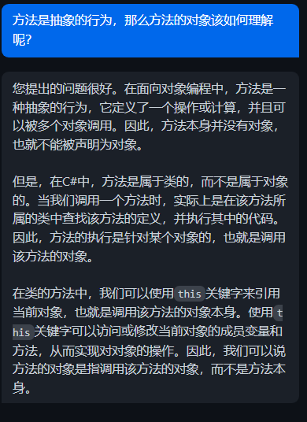
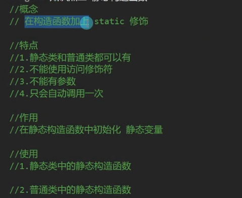
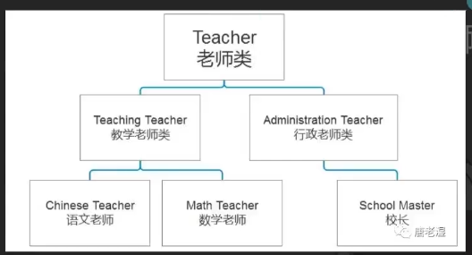
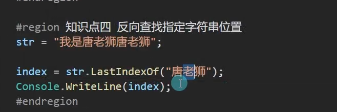

# c#核心概述

**个人遇到的概念问题**：



**面向对象三大特性**

**面向对象七大原则**

**面向对象相关知识**

大纲：


# c#核心

## 面向对象编程概念


目的：

提高代码复用率

提高开发效率

提高程序可扩展性

清晰的逻辑关系

**如何学习面向对象：**


## 面向对象——封装

### 类和对象

#### 1、什么是类

基本概念：

具有相同特征

具有相同行为

一类事物的抽象

类是对象的模板

可以通过类创建出对象

类的关键词：class

类中的成员默认是private私有的，而struct的成员默认是public（公共的）

#### 2、类声明在哪里，类声明的语法，类声明实例

```c#
class 类名(可为中文)
{
    //特征——成员变量
    //行为——成员方法
    //保护特征——成员属性
    
    //构造函数和折构函数
    //索引器
    //运算符重载
    //静态成员
}
//类的是用来形容人类的
//命名:使用帕斯卡命名法（每个单词首字母大写）
//注意:同一个语句块中的不同类不能重名(不同命名空间下的同名类有特殊的使用方式)
class Person
{
    
}
```

类即是封装

#### 3、什么是（类）对象

基本概念：

类的声明和类对象（变量）声明式两个概念

类的声明类似枚举和结构体的声明，类的声明相当于声明了一个自定义变量类型

而对象，是类创建出来的，相当于声明一个指定类的变量

类创建对象的过程，一般被称为实例化对象

类对象，都是引用类型的

#### 4、实例化对象基本语法

```c#
类名 变量名;
类名 变量名 = null;(null代表空)
类名 变量名 = new 类名();
```

```c#
Person p;
Person p2 = null;	//Person p2 这个句子等于是在栈上开辟新的空间,Person p和Person p2 = null 这两句代码的意义完全相同，都是在栈上开辟一个null的新的空间
Person p3 =new Person();	//new关键词用于在堆上动态分配内存
Person p4 = new Person();
//虽然他们是来自一个类的实例化对象
//但是他们的特征行为等等信息都是他们独有的
//他们只是保留了作为人的共同基础特征和行为
```

总结：

类的声明和类对象的声明是两个概念

类的声明式声明独享的模板，是用来抽象（形容）显示事物的

类是对象的声明，是用来表示现实中的对象个体的

类是一个自定义的变量类型

实例化一个类对象，是在声明变量

==容易搞错的地方：==要注意的是null虽然是引用类型，但作用是在栈上的，是特殊的引用类型。


B = null 指的是B的栈上的地址变为了null，所以虽然GameObject是引用类型，但实际改变B的值不会对A造成影响。

要注意的是null是值类型，影响的是栈，如果是引用类型之间互相赋值，那么就会影响堆上的值。


### 成员变量和访问修饰符

#### 1、成员变量

- 声明在类语句块中
- 用来描述对象的特征
- 可以是任意变量类型
- 数量不做限制
- 是否赋值根据需求来定

```c#
enum E_SexType
{
    Man,
    Woman,
}

struct Position
{
    
}
class Person
{
	//特征——成员变量
    //姓名
    public string name ="唐老狮";
    //年龄
    public int age;
    //性别
    public E_SexType sex;
    //因为类是引用类型，所以只要不初始化或者赋值的话，他就不会像结构体（值类型）那样循环自己调用自己,但是可以把初始化的过程写在方法中
    Person girlFriend;
    //朋友
    Person[] boyFriend;
	Position pos;    
}
```

**如何使用类：**

```c#
class Program
{
    static void Main(string[] args)
    {
        Person p =new Person();	//只要new了Person,那么里面的成员变量就都会有初始值
        p.age = 18;
	}
}
```

#### 2、访问修饰符

- public——公共的 自己（内部）和别人（外部）东鞥访问和使用
- private ——私有的 自己（内部）才能访问和使用，不写，默认为private
- protected——保护的 自己和子类才能访问和使用
- 决定了类内部成员的访问权限

#### 3、成员变量的使用和初始值

==值类型来说，数字类型，默认值都是0，bool类型默认值是false，char类型的默认值是空字符==

==引用类型的默认值都是null== null和空字符是两个不同的概念

`Console.WriteLine(default(int));`**查看默认值的小技巧**

---

阶段性总结：


s.deskmate.age为20

---


### 成员方法

#### 基本概念：

1. 成员方法（函数）用来表现对象行为
2. 声明在类语句块中
3. 是用来描述对象的行为的
4. 规则和函数声明规则相同
5. 受到访问修饰符规则影响
6. 返回值参数不做限制
7. 方法数量不做限制

**注意：**

1. 成员方法不要加static关键字
2. 成员方法，必须实例化对象，再通过对象来使用，相当于该对象执行了某个行为
3. 成员方法，受到访问修饰符的影响

```c#
class Person
{
    public void Speak(string str)
    {
        Console.WriteLine("{0}说{1}",name,str);
    }
  
    public bool IsAdult()
    {
        return age>=18
    }
    public string name;
    public int age;
}
```

#### 成员方法的使用

```C#
static void Main(string[] args)
{
	Person p=new Person();
	p.name= "唐老狮";
	p.age=18;
	p.Speak("我爱你");
}
```


### 构造函数和折构函数

#### 构造函数

**基本概念**：

在实例化对象时，会调用的用于初始化的函数

如果不写，默认存在一个无参构造函数

**构造函数的写法：**

1.**没有返回值**

2.函数名和类名必须相同

3.没有特殊需求时，一般是public的

4.构造函数可以被重载

5.this代表当前调用该函数的对象自己

**注意：**

==如果不自己实现无参构造函数而实现了有参构造函数，会失去默认的无参构造==

==类中允许自己声明无参构造函数，而结构体中则不允许==

通过this关键字区分传入的参数和对象自己的变量


#### 构造函数的特殊写法

- 可以通过this重用构造函数代码
- `访问修饰符 构造函数名(参数列表):this(参数1,参数2….)

==如果采用这种特殊写法，那么实际构造函数会先调用冒号后的构造函数==

`public Person(string name):this(name){} `this在后面中可以省略掉string直接简写为name，作用为完成构造函数的复用


如果冒号前面的构造函数本身没有传入参数，那么冒号后this传入的参数可以通过写死的方式来进行传参，这样的话会默认调用`this.变量名 = 传入写死的参数;`:


也可以进行有参的自写规则进行初始化


变量为private类型时适合在构造函数中进行赋值：


#### 析构函数

**基本概念：**

当引用类型的堆内存被回收时，会调用该函数

对于需要手动管理 内存的语言（比如c++），需要在析构函数中做一些内存回收处理

但是c#中存在自动垃圾回收机制GC

所以我们几乎不会怎么使用析构函数。除非你想在某一个对象被垃圾回收时，做一些特殊处理

**注意：**

在unity开发中析构函数几乎不会被使用，所以只需了解即可

**基本语法：**

````c#
~类名()
{
    
}
````

==析构函数时当垃圾真正被回收的时候，才会自动调用的函数==

#### 垃圾回收机制


每代内存满的时候触发GC，将自己即比自己小的代数中不可抵达的内存空间全部释放，然后移步到下一代内存中


==手动GC的方法==:

`GC.Collect();` 一般情况下不会进行频繁调用，会在load条时进行调用

**总结：**


### 成员属性

#### 1.成员属性的基本概念


#### 2.成员属性的基本语法

```c#
访问修饰符 属性类型 属性名
{
    get{}
    set{}
}
class Person
{
    paivate string name;
    private int age;
    private int money;
    private bool sex;
    
    //属性的命名一般使用帕斯卡命名法
    public string Name
    {
        get
        {	
            //可以在返回之前添加一些逻辑规则
            //意味着这个属性可以获取的内容
            return name;
        }
        set
        {
            //可以在设置之前添加一些逻辑规则
            //value关键字表示外部传入的值
            name =value;
            
        }
	}
        
}
```

#### 3.成员属性的使用

````c#
p.Name="吃猫的鱼";	//实际执行的代码是set语句
Console.WriteLine(p.Name);	//本质执行的是get语句块进行返回值	
````


```c#
public int Money
{
    get
    {	//加密处理,get 用于返回值
        return money;
    }
    set
    {	//加密处理,set用于获取值
        if(value<0)
        {
            value =0;
            Console.WriteLine("输入的值不能小于0");
        }
        money = value;
    }
}
```

从内存的角度展示get和set如何进行加密处理：

```c#
public int Money
{
    get
    {	//解密处理,get 用于返回值
        return money -5;
    }
    set
    {	//加密处理,set用于获取值
        
        money = value+5;
    }
}
```


#### 4.成员属性中 get和set前可以加访问修饰符


**只能修改不能得到属性的值：**


**不能同时让属性中的get方法和set方法同时有访问修饰符：**


**内部权限不能大于外部权限：**


#### 5.set和get可以只有一个

只有一个时，没必要在前面加访问修饰符

```c#
public bool Sex
{
    //只有get，起到保护作用                                                           
	get
    {
        return sex;
    }
}
```


#### 6.自动属性


```c#
public flaot Height
{
    //没有在set和get中写逻辑的需求或者想法
    get;
    set;
}
```

使用自动属性可以不需要在类中进行成员变量的声明，比如这里定义了Height属性，那么按照常规的写法应该是需要在类中声明变量`private float height;`

然后这样写：

```c#
public float Height
{
	get
	{
		return height;
	}
	set
	{
		height = value;
	}
}
```

==使用自动属性可以简化这一过程==

---

**总结：**


---

### 索引器

#### 1.索引器基本概念

**让对象可以像数组一样通过索引访问其中元素，使程序看起来更直观，更容易编写**

#### 2.索引器语法

==之前学习到的this的两种用法：在函数当中表示对象自己；在构造函数中this可以代表当调用某个构造函数之前，先调用this后的构造函数。==


```c#
class Person
{
    private string name;
    private int age;
    private Person[] friends;
    //index表示是第几个朋友
    public Person this[int index]
    {
        get
        {
            return friends[index];
        }
        set
        {
            //value代表传入的值
            friends[index] = value;
        }
    }
}
```


#### 3.索引器的使用

```c#
class Program
{
	static void Main(string[] args)
    {
        Console.WriteLine("索引器");
        Person p =new Person();
        
        //即对象后面出现像中括号一样的东西而不是".成员"就意味着这里使用了在类中声明的索引器
        p[0] = new Person(); 	//这段代码的含义表示初始化了一个新的Person类型的对象，将其初始化为其默认值，并返回该对象的引用将其装载在p[0]当中。
        Console.WriteLine(p[0]);	//相当于使用了索引器中的get方法
        
    }
}
```


#### 4.索引器中可以写逻辑

与属性类似


#### 5.索引器可以重载

重载的概念是——函数名相同，参数类型，数量，顺序不同

```c#
private Person[] friends;
private int[,] array;

public int this[int i,int j]
{
    get
    {
        return array[i,j];
    }
    set
    {
        array[i,j] = value;
    }
}
public string this[string str]
{
    get
    {
        switch(str)
        {
            case "name":
                return this.name;
            case "age":
                return age.Tostring();
            
		}
        return "";
        
    }
}
```

---

总结：


索引器往往适用于外部封装类中的数组类型的成员变量，相当于属性之于值类型的成员变量

---

### 静态成员

==静态成员的值会在程序开始时就分配运行空间，并且既不是存放在堆上也不是存放在栈上，而是在有一个专门存放静态成员的内存空间==

#### 1.静态成员的基本概念


#### 2.早已出现的静态成员

```c#
class Test
{
    //static 可以写在public 前面也可以写在后面
    static public float PI = 3.1415926f;
    public int testInt =100;
    
    //静态成员方法
    public static float CalacCircle(float r)
    {
        //Πr^2
        return PI*r*r;
    }
    //普通成员方法
    public void TestFun()
    {
        Console.WriteLine("123");
	}
}
```

#### 3.自定义静态成员

#### 4.静态成员的使用


#### 5.为什么可以直接点出来使用

👇


#### 6.静态函数中不能使用非静态成员

- 成员变量只能将对象实例化出来后，才能点出来使用，不能无中生有
- 不能直接使用非静态成员，否则会报错

==因为成员变量在对象实例化之前都没有生成==

#### 7.非静态函数可以使用静态成员

通过对元素生命周期的理解可以很好理解

#### 8.静态函数对于我们的作用


#### 9.常量和静态变量


常量也可以直接类名直接“.”出来

#### 总结：


---


### **静态类和静态构造函数**

#### 1.静态类

主要是作为==工具类==


```c#
static class TestStatic
{
	public static int testIndex =0;	//静态成员变量
    public static void TestFun()
    {
        
	}
    public static int TEstIndex
    {
        get;
        set;
	}
}

```

#### 2.静态构造函数

##### 静态类中的静态构造函数：



注意静态构造函数只会在第一次使用时自动调用一次， 不是每次使用类的对象都会调用


##### 普通类中的静态构造函数

```c#
class Test
{
	public static int testInt =200;
	static Test()
	{
	COnsole.WriteLine("静态构造");
	}
    public Test()	//这里并不是函数的重载，而就是单纯的单独的构造了一个静态构造函数
    {
        Console.WriteLine("普通的构造函数");
	}
	
}
```

同样符合规则，即在第一次使用类中的内容时会自动调用一次

---

#### 总结


### 扩展方法

#### 1.扩展方法基本概念


#### 2.基本语法


#### 3.实例


#### 4.使用


#### 5.为自定义的类型扩展方法

```c#
class Test
{
    public void Fun1()
    {
        Console.WriteLine("123");
	}
    public void Fun2()
    {
        Console.WriteLine("456");
    }
}
```

```c#
static class Tools
{
    public static void Fun(this Test t)
    {
        Console.WriteLine("为test扩展的方法");
    } 
    
}
```

==如果扩展方法的方法名和原有的方法名相同，那么在调用时会使用原有的方法，也就是说扩展的方法会无效==

---

#### 总结


### 运算符重载

#### 基本概念

在类的内部使用

 

#### 基本语法

```c#
public static 返回类型 operator 运算符(参数列表)
```


#### 实例

```c#
class Point
{
    public int x;
    public int y;
    
    public static Point operator +(Point p1,Point p2)
    {
        Point p = new Point();
        p.x = p1.x + p2.x;
        p.y = p1.y + p2.y;
        return p;
    }
    //一个符号可以多个重载，重载参数的顺序在使用重载运算符时必须符合规则
     public static Point operator +(Point p1,int value)
    {
        Point p = new Point();
        p.x = p1.x + value;
        p.y = p1.y + value;
        return p;
    }
    
}
```

#### 使用


#### 可重载和不可重载的运算符

##### 可重载的运算符

- 算术运算符


- 逻辑运算符

  

  逻辑或和逻辑与不允许重载

- 位运算符


- 条件运算符

==条件运算符需要成对实现==

1.返回值一般是bool值，也可以是其它的

2.相关符号必须配对实现

==如果重载了大于符号，那么就必须重载小于符号==


 

##### 不可重载的运算符


---

总结：


---

### 内部类和分部类

#### 1.内部类


```c#
class Person
{
    public int age;
    public string name;
    public Body body;
    public class Body
    {
        Arm leftArm;
        Arm rightArm;
        
        class Arm 
        {
            
        }
    }
}
```


#### 2.分部类


如果有访问修饰符的话，需要将访问修饰符放在partial前面

```c#
partial class Student
{
    public bool sex;
    public string name;
}
partial class Student
{
    public int number;
    public void Speak(string str)
    {
        
    }
}
```

相当于把一个类分成几个部分来写。


#### 分部方法


将方法的声明和实现分开

## 面向对象——继承


### 继承的基本规则

#### 1.基本概念

==c#不能多继承==，c++支持多继承 




#### 2.基本语法

```c#
class 类名:被继承的类名
{
	
}
```

#### 3.实例

```c#
class Teacher
{
	public string name;
    public number;
    public void SpeakName()
    {
        COnsole.WriteLine(name);
	}
}
class TeachingTeacher:Teacher
{
    //科目
    public string subject;
    //介绍科目
    public void SpeakSubject()
    {
        Console.WriteLine(subject +"老师");
	}
}
```


#### 4.访问修饰符的影响

- public - 公共的，内外部访问
- private - 私有，内部访问
- protected - 保护，内部和子类访问 
- internal - 内部的，只有在同一个程序集和文件中。内部类型或者是成员才可以访问

#### 5.子类和父类的同名成员

概念：

c#中允许子类存在和父类相同的成员，但及不建议使用

 #### 总结：


---

### ==里氏替换原则==

作用是在处理一些游戏相关的逻辑时，使用父类容器装载子类对象，可以使代码的可读性提高，比如要处理怪物的攻击逻辑时，怪物作为父类有杂兵，精英，boss三种类型的子类，那么如果用父类的容器装载子类对象的话，可以先做一些逻辑判断，再去使用对应子类对象中的方法

#### 1.基本概念


#### 2.基本实现

```c#
class GameObject
{
    
}
class Player:GameObject
{
    public void PlayerAtk()
    {
        Console.WriteLine("玩家攻击");
    }
}
class Monster:GameObject
{
    public void MonsterAtk()
    {
        Console.WriteLine("怪物攻击");
    }
}
class Boss:GameObject
{
    public void BossAtk()
    {
        Console.WriteLine("Boss攻击");
    }
}

class Program
{
    Console.WriteLine("里氏替换原则");
    //父类容器装载子类对象
    GameObject player = new Player();
    GameObject monster = new Monster();
    GameObject  boss=new Boss();
    //new Player() 是一个行为，它是创建一个 Player 类型的新对象的操作。在这个操作完成之后，它会返回一个指向新对象的引用，这个引用可以被赋值给变量，以便在后续的代码中使用这个对象。因此，new Player() 本身不是一个变量，而是一个创建对象的操作。
    GameObject[] objects = new GameObject[]{new Player(),new Monster(),new Boss()};
}
```

#### 3.is和as

==用于解决子类被装载在父类容器中但无法调用子类自身的成员的问题==


```c#
if(player is Player)
{
    Player p = player as Player;
    p.PlayerAtk();
    
    //等价的简写
    (player as Player).PlayerAtk();
}

for (int i=0;I<objects.Length;i++)
{
    if(objects[i] is Player)
    {
        (objects[i] as Player).PlayerAtk();
	}
    if(objects[i] is Monster)
    {
        (objects[i] as Monster).MonsterAtk();
	}
    if(objects[i] is Boss)
    {
        (objects[i] as Boss).BossAtk();
	}
}
```

**总结：**


例如：`Father f = new Son();`中会先进行调用Father的无参构造函数，再调用Son的指定构造函数。

---


### 继承中的构造函数


#### 1.继承中的构造函数基本概念


#### 2.继承中构造函数的执行顺序


#### 3.父类的无参构造函数很重要

 ==父类中不能只有一个有参构造函数，必须有无参构造函数，不然子类会报错。==

子类实例化时，默认自动调用的是父类的无参构造，所以如果父类无参构造被顶掉，会报错。

#### 4.通过base调用指定父类构造

避免出现上面报错的方式：


总结：


==this用在构造函数的重载后面，用来调用构造函数的重载，this后面的参数表示先调用哪个构造函数的重载，而base关键字则是用来先调用基类的构造函数，根据base后面的参数来选择调用的具体构造函数的重载==

#### 例题讲解用法:

虽然是常用的语法，但实际的使用是反直觉的。

```c#
 class Worker
    {
        public string workType;
        public string workContent;
        //Worker是程序员、策划、美术的基类，所以可以通过创建Worker类的对象，主动输入参数来确定workType和workContent变量的值
        public Worker(string workType,string workContent)
        {
            this.workContent = workContent;
            this.workType = workType;
        }
       
    }
    class Programmer:Worker
    {
        //这里直接写死，因为通过Programmer类实例化的对象的workType和workContent一定是程序员和写代码，在使用时通过要实例化的类型来进行调用
        public Programmer() : base("程序员","写代码")
        {
            

        }
    }
    class Art : Worker
    {
        public Art() : base("美术","画画")
        {

        }
    }
    class Planner : Worker
    {
        public Planner() : base("策划", "游戏设计")
        {

        }
    }
```


### 万物之父和装箱拆箱

#### 1.万物之父


#### 2.万物之父的使用


==要注意这里值类型之间转换是使用强制转换，而引用类型之间的转换则使用as和is关键字==

#### 3.装箱拆箱


总结：


---

### 密封类

#### 1.基本概念

密封类：是使用 sealed密封关键字修饰的类

作用：让类无法再被继承

#### 2.实例


#### 作用


## 面向对象——多态

### Vob(virtual、override、base)

#### 1.多态的概念


#### 2.解决的问题

存在的问题：


 

**这样写的话实际会执行的是father的方法**

而如果是`(f as Son).SpeakName();`这样写，执行的会是son的方法

#### 3.多态的实现


多态的使用：
 父类中使用Virtual关键字，子类中使用override关键字


可以使用base关键字保留父类的行为。

`base.父类中的方法();`

---

总结：

如果在 `Father` 类中的 `SayHI` 方法没有使用 `virtual` 关键字，那么 `Son` 类中的 `SayHI` 方法就无法重写该方法，此时在执行 `f.SayHI()` 时，会调用 `Father` 类中的 `SayHI` 方法，输出的是 "爸爸说你好"，而不是 "儿子说你好"。


使用 `virtual` 关键字可以使 `Father` 类中的 `SayHI` 方法成为虚方法，这样 `Son` 类就可以通过使用 `override` 关键字来重写该方法，而不是创建一个新的方法。这样，当使用 `Father f = new Son();` 创建一个 `Son` 类型的实例时，`f` 的静态类型是 `Father`，但是它的动态类型是 `Son`，因此在执行 `f.SayHI()` 时，会根据实际类型来调用相应的方法，输出的是 "儿子说你好"。

---


### 抽象类和抽象方法

#### 1.抽象类


```c#
abstract class Thing
{
    //抽象类中封装的所有知识点都可以在其中书写
	public string name;
    //可以在抽象类中写抽象函数
    
}
class Water:Thing
{
    
}
```

不能被实例化：


但是遵循里氏替换原则：


#### 2.抽象函数


```c#
avstract class Fruits
{
    public string name;
    //抽象方法不能游函数体 
    public abstract void Bad();	//不能不加访问修饰符，必须使用public或者protected,也不能打大括号
    
    public virtual void Test()
    {
        //可以选择是否写逻辑
    }
    
    
}
class Apple:Fruits
{
    
    public override void Bad()
    {
        throw new NotImplementedException();	//当执行时会默认丢一个提示错误
    }
}
```

虚方法和抽象方法的区别：

- ==虚方法在父类中可以选择是否写逻辑，而抽象方法在父类中不能有方法体。==

- ==虚方法在子类中可以由子类选择性的实现，而抽象方法只要在父类中定义了就必须在子类中实现==

- 抽象方法只能在声明在抽象类中，虚方法则可以在任意地方声明
- **当子类的子类继承子类，而在子类中已经完成了对父类抽象类的实现，那么子类的子类中不是必要对抽象类进行实现**

共同点：

- 虚方法和抽象方法都可以被子类无限的重写

#### 总结：


### 接口

#### 1.接口的概念


#### 2.接口的声明


```c#
interface IFly
{
    //注意接口不能包含成员变量
    public void Fly();
    
    string Name
    {
      	get;
        set;
	}
    int this[int index]
    {
        get;
        set;
	}
    event Action doSomthing;
	
}
```


#### 3.接口的使用


==可以通过里氏替换原则实现接口装载不同但具有相同行为的类==

 

#### 4. 接口可以继承接口


#### 5.显示实现接口


**显示实现接口，就是用**`接口名.行为名`**去实现**

 

显示实现接口的缺点是，如果用子类直接去实例化对象时，是无法调用被显式实现的接口的，必须通过以父类装载子类的方式去调用。

#### 总结：


### 密封方法

#### 1.密封方法基本概念


#### 2.实例


#### 总结：


不能与virtual或者是abstract关键词一起使用

## 面向对象关联知识点

### 命名空间

#### 1.命名空间基本概念

命名空间中的类不能使用private和protected访问修饰符

使用帕斯卡命名法进行命名


#### 2.命名空间的使用


**命名空间可以分开写：**可以分成两块，也可以分成两个文件，但在同一个命名空间中不能有同名类。


#### 3.不同命名空间中相互使用，需要引用命名空间  或指明出处

1.需要在文件的开头使用using关键词引用


2.也可以具体的指明出处：


#### 4.不同命名空间中允许有同名类

如果要使用另一个命名空间中的同名类，必须使用指明出处的方式去进行调用：

#### 5.命名空间可以包裹命名空间

要使用被包裹的命名空间，只引用了比它层级高的命名空间是没用的，要使用哪个命名空间就必须引用哪个命名空间。


#### 6.关于修饰类的访问修饰符


总结：


### 万物之父中的方法

#### 知识回顾：


#### 1.object中的静态方法


引用类型要判断是否相等必须判断是否指向同一个内存地址

#### 2.object中的成员方法


浅拷贝的意思：


#### 3.object中的虚方法


#### 总结：


### String

#### 1.字符串指定位置获取


string内部的索引器


#### 2.字符串拼接


#### 3.正向查找字符位置


如果没有找到会默认返回一个-1

#### 4.反向查找指定字符串位置



没找到返回-1

#### 5.移除指定位置后的 字符


 

#### 6.替换指定字符串


#### 7.大小写转换


#### 8.字符串截取


#### 9.字符串切割

 

通过字符`,`进行切割，将字符串存入数组中

### StringBuilder

#### 概念


#### 初始化 直接指明内容

必须初始化引用`using namespace System.Text`


#### 容量


 和string类型作对比，改善性能通过的是自动双倍扩容，所以进行**“搬家”**活动产生的垃圾频率相对较低。

每次分配新房间是乘以2倍进行扩容。


#### 增删查改替换

- 增

`str.Append(“4444”);`

当长度超出容量时会进行*2扩容，之前16的房间会变成垃圾。

`str.AppendFormat(“{0}{1}”,100,999);` 

- 插入


- 删

`str.Remove(0,10);`

删除前10个字符

- 清空

`str.Clear();`

- 查

直接通过字符串数组下标进行查

- 改

string类型的字符串数组无法通过数组下标的形式进行直接更改数据，因为是只读的：`str[0] =‘A’;`但stringBuilder类型可以通过这个方式直接进行更改

- 替换

`str.Replace(“1”,”唐”);`

和string类型的区别是str类型需要新创建一个新的变量去装调用Replace函数产生的新值，而stringBuilder类型更接近引用类型，调用了这个方法后本身就发生了改变。

- 重写赋值 StringBuilder

```c#
str.Clear();	//先进行清空再重新赋值
str.Append("123123");
```


#### ==总结==：

**string和stringbuilder的区别**


**如何优化内存**


### 结构体和类的区别

#### 区别概述


#### 细节区别


#### 结构体的特别之处

==结构体可以继承接口，因为接口是行为的抽象==

#### ==如何选择结构体和类==


### 抽象类和接口的区别

#### 知识回顾


#### 1.相同点


#### 2.区别


#### 3.如何选择抽象类和接口


