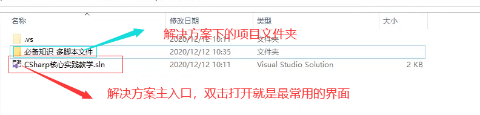
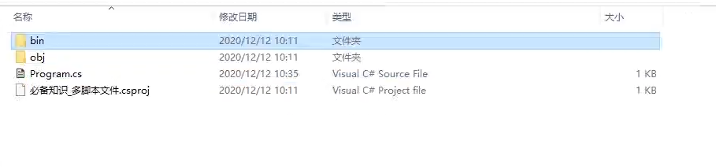
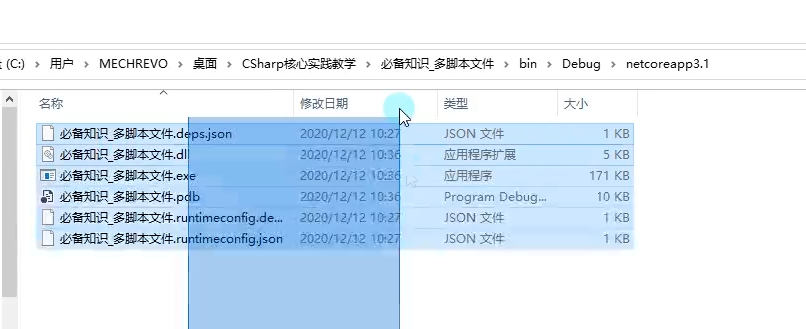
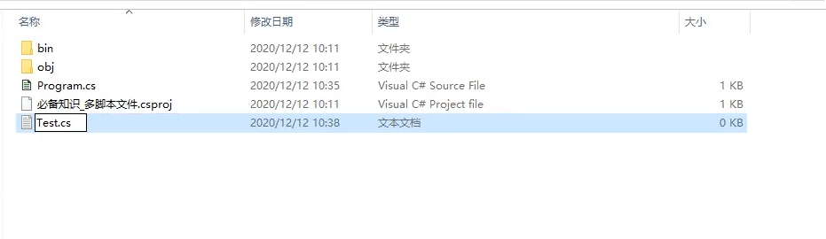
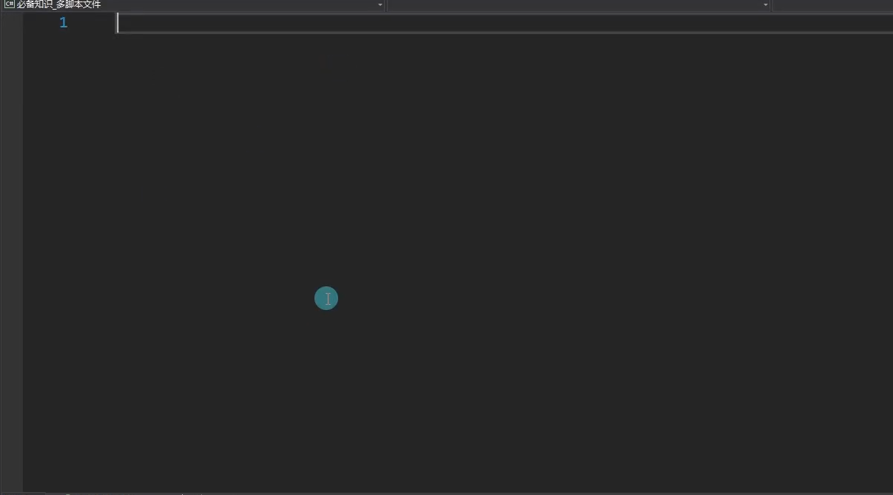
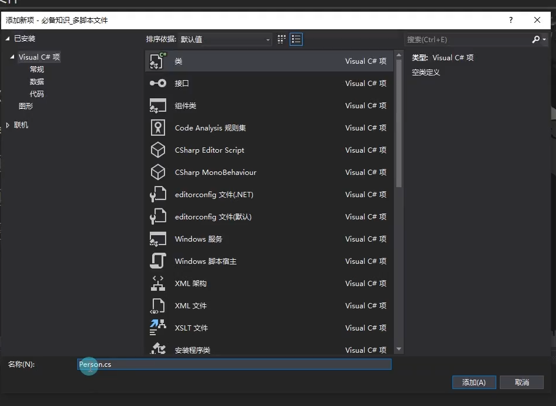
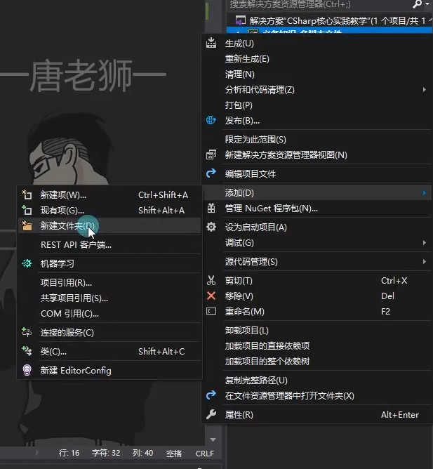
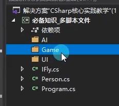
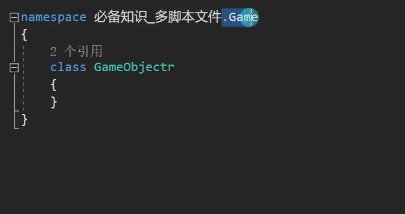
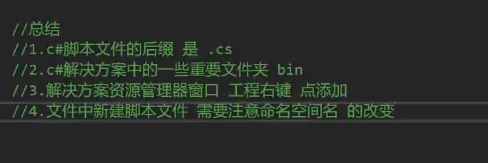

## 知识点一.了解脚本文件格式和路径

进入项目文件夹后

bin中存放了调试生成的可执行文件，必须要执行文件才会生成

**要将可执行文件拷贝给他人运行，只需要将bin下的Debug文件夹中的netcoreapp文件夹拷贝，然后让其执行exe文件即可。**

`.cs`==后缀的是纯脚本文件==

## 知识点二.新建脚本文件

###1.可以通过新建文本的方式更改后缀来新建脚本文件。

能快速新建大量文件，缺点是项目文件不会自动引用基础的头文件而是一片空白：

### 2.在项目文件中右键新建类或者接口

在实际的游戏开发当中，尽量做到一个类一个脚本，一个接口一个脚本，一个结构体一个脚本，枚举可以一个类一个脚本，但更多的还是和类写在一起

## 知识点三.在文件夹中新建脚本文件

可以将相似或者同类功能的类或者接口放在一个文件夹中

==要注意的是在文件夹中新建脚本文件，默认的命名空间会在工程文件的后面加上`.文件夹`名称作为默认的命名空间名==

## 总结：

