# c#进阶概述

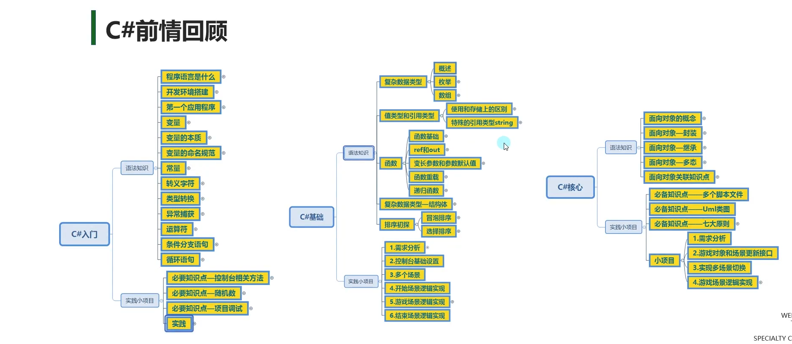

**主要学习内容：**

- 数据集合
- 泛型相关
- 委托事件
- 多线程
- 反射和特性

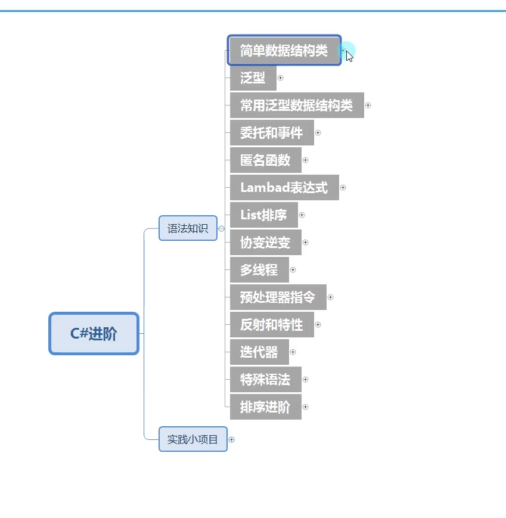

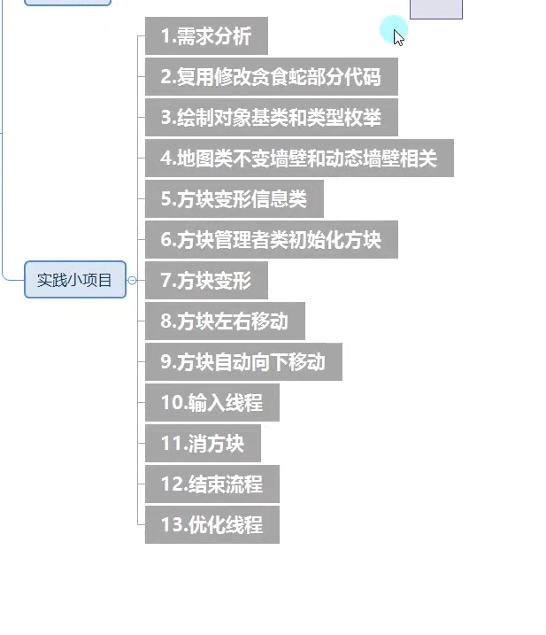

# 简单数据结构类

## ArrayList

### 1.ArrayList的本质

- ArrayList是一个c#为我们封装好的类
- 它的本质是一个object类型的数组
- ArrayList类帮助我们实现了很多方法，
- ==比如数组的增删查改==

### 2.声明

==要使用必须先引用命名空间==:`using System.Collections;`

```c#
ArrayList array = new arrayList();
```

### 3.增删查改

- 增

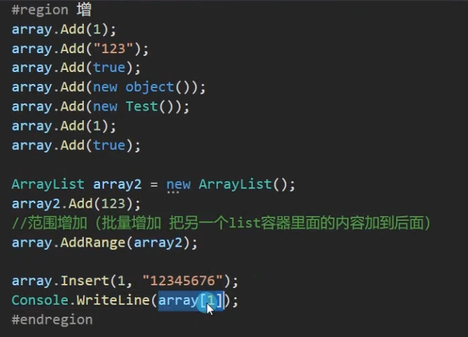

- 删

如果有两个相同数，那么先删数组中下标靠前的元素。

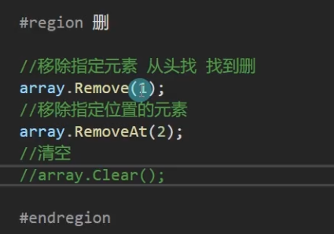

- 查

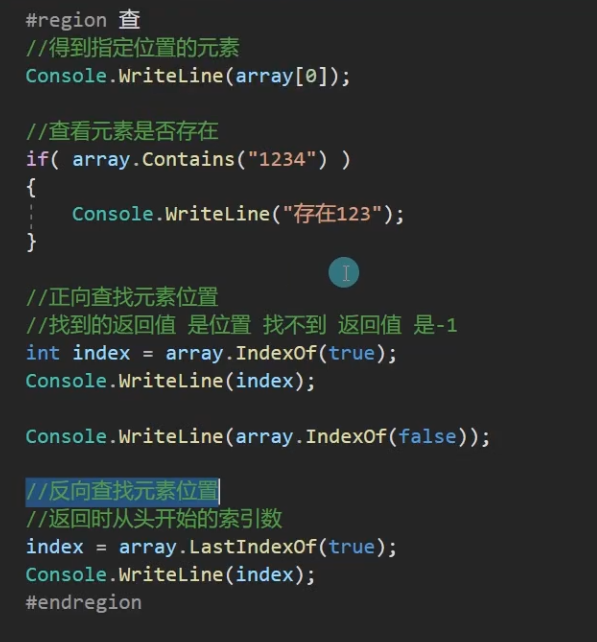

- 改

通过查进行改

### 4.遍历

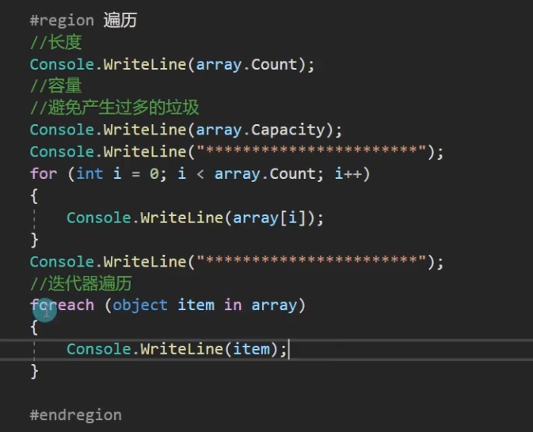

### 5.装箱拆箱

- ArrayList本质上是一个可以自动扩容的object数组，
- 由于用万物之父来存储数据，自然存在装箱拆箱
- 当往其中进行值类型存储时就是在装箱，当将值类型对象取出来转换使用时，就存在拆箱
- 所以ArrayList尽量少用，之后我们会学习更好的数据容器。 

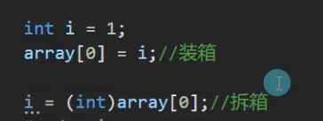

## Stack(栈)

### 1.Stack的本质

- Stack(栈)是一个c#为我们封装好的类
- 它的本质也是object[]数组，只是封装了特殊的存储规则
- Stack是栈存储容器，栈式一种先进后出的数据结构
- 先存入的数据后获取，后存入的数据先获取
- 栈是先进后出

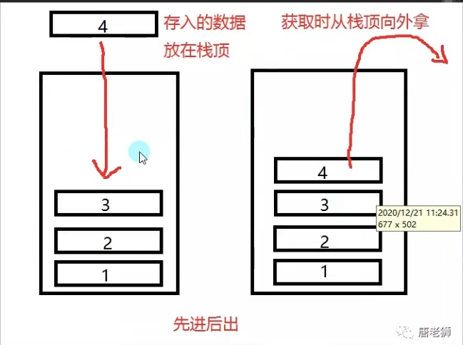

### 2.声明

==需要引用命名空间==`System.Collections`

`Stack stack = new Stack();

### 3.增删查改

- 增

压栈 push（压）

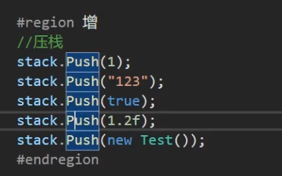


- ==取==

  - 栈中不存在删除的概念
  - 只有取得概念
  - 弹栈

  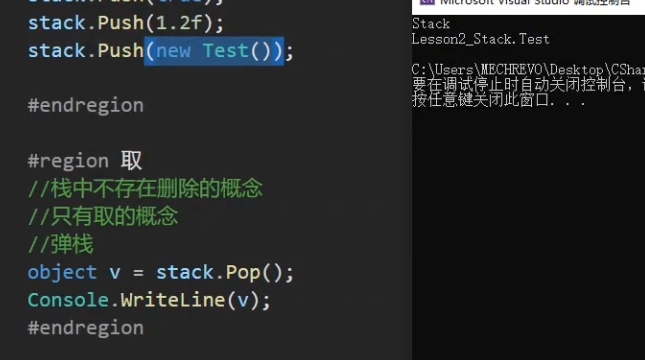


==栈的存和取都只能一个一个的进行，所以没有像ArrayList那样范围增或者范围取的方法==

- 查

  - 1.栈无法查看指定位置得元素
  -  只能查看栈顶得内容

  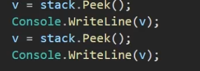

  - 2.查看元素是否存在于栈中

  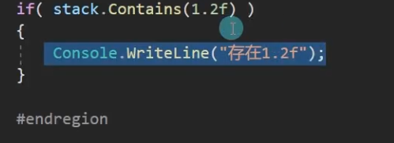

- 改

  - 栈无法改变其中的元素，只能压（存）和弹（取）
  - 实在要改，只有清空
  - 

### 4.遍历

==栈没有办法通过for循环进行遍历，因为没有索引器和下标==

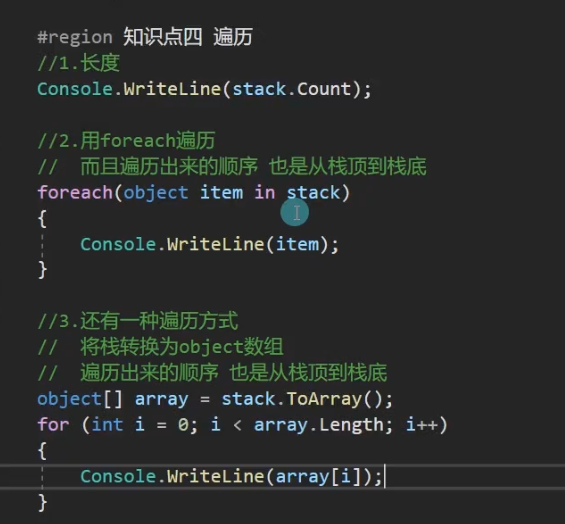

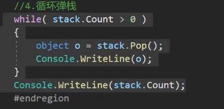

### 5.装箱拆箱

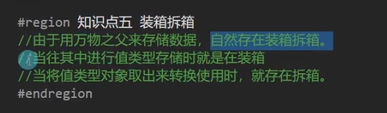

## Queue（队列）

和栈相似，都不能通过下标索引的方式获取具体的某个元素

### 1.Queue的本质

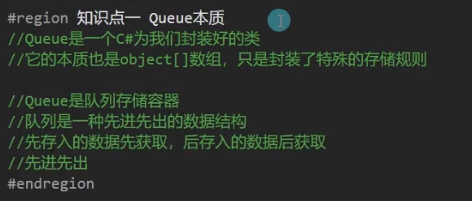

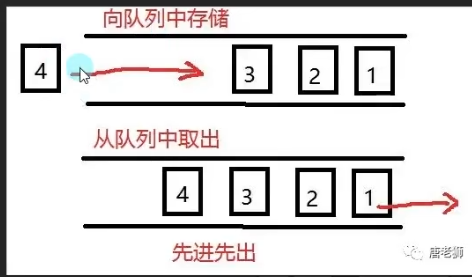 

### 2.声明

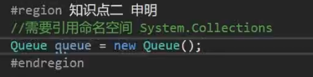

### 3.增取查改

- 增

  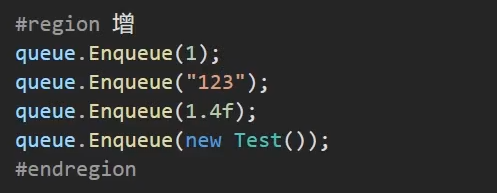

- 取

  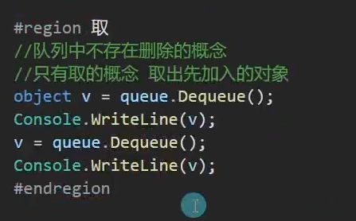

- 查 

  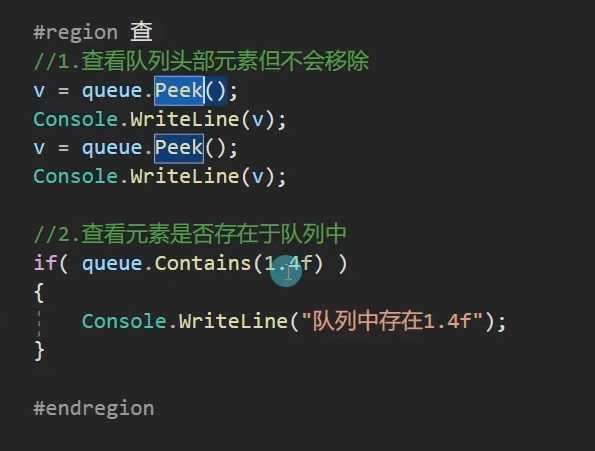

- 改

  - 队列无法改变其中的元素，只能进出队列
  - 实在要改，只有清楚后再放入

  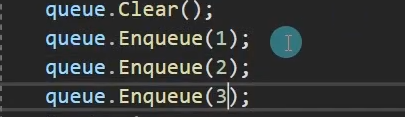

### 4.遍历

- 1.长度

- 2.用foreach遍历

- 3.还有一种遍历方式

  将队列转换为object数组

- 4.循环出列

  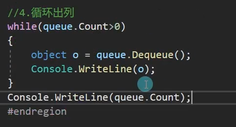

### 5.装箱拆箱

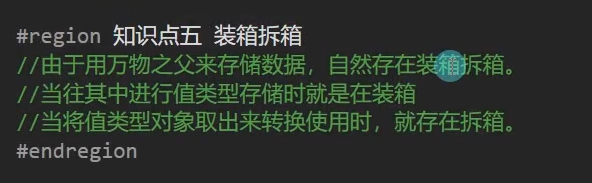

## Hashtable（哈希表）

### 1.Hashtable的本质

- Hashtable(又称散列表)是基于键的哈希代码组织起来的键/值对
- 它的主要作用是提高数据查询的效率
- 使用键来访问集合中的元素
- 只能通过键找到值，不能反过来通过值去查找键

### 2.声明

- 需要引用命名空间 System.Collections

```c#
Hashtable hashtable = new Hashtable();
```

### 3.增删查改

- 增

  - ==注意不能出现相同键==，但值可以重复。
  - 键和值都是object类型

  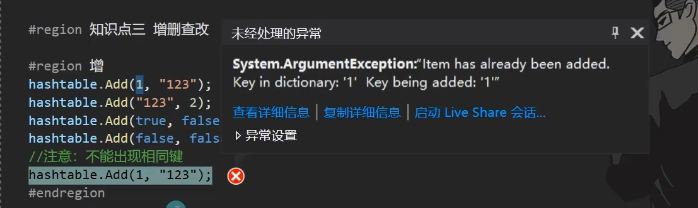

- 删

  - 1.只能通过键去删除

    ```c#
    hashtable.Remove(1);	//只能被识别为前面的键
    ```

  - 2.删除不存在的键，没反应

    ```c#
  hashtable.Remove(2);
    ```
  
  - 或者直接清空

    ```c#
  hashtable.Clear();
    ```

- 查

  - 1.通过键查看值，找不到会返回空（null）

    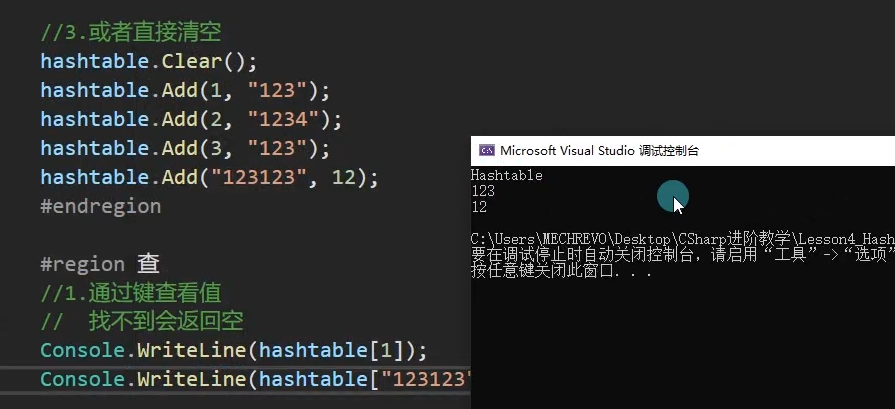

  - 2.查看是否存在

    注意填的不是下标而是值。

    - 根据键检测

      `hashtable.Contains()`和`hashtable.ContainsKey()`的作用一样，在检测时要注意键的数据类型，例如:`2和“2”是不同的`

      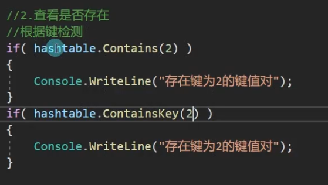

    - 根据值检测

      

- 改

  - 只能改键对应的值内容，==无法修改键==

  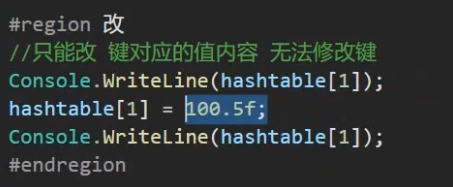

### 4.遍历

**得到键值对对数。**

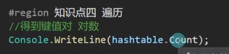

- 1.遍历所有键

  ==注意是hashtable.Keys而不是直接in hashtable==

  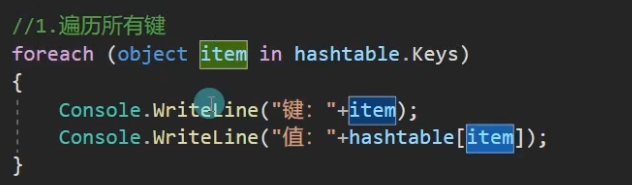

- 2.遍历所有值

  **hashtable.Values**

  不能通过`hashtable.Values[0]`这样的语句去获取值，否则会报错，只能通过foreach的形式

  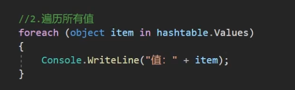

- 3.键值对一起遍历

  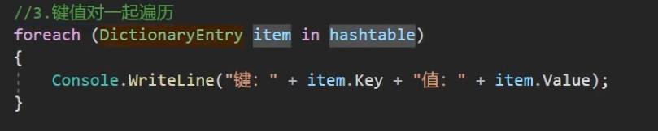

- 4.迭代器遍历法

  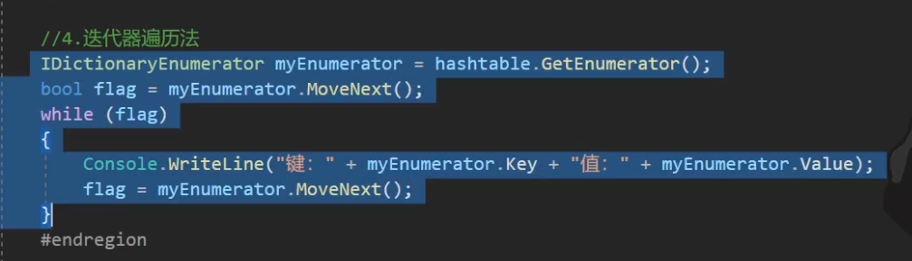

### 5.装箱拆箱

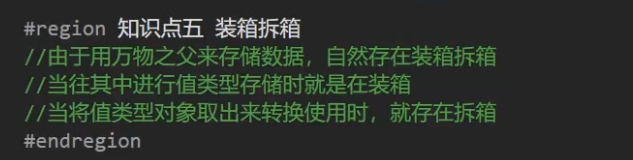

# 泛型

## 泛型

### 1.泛型是什么

- 泛型实现了类型参数化，达到代码重用目的
- 通过类型参数化来实现同一份代码上操作多种类型
- 泛型相当于类型占位符
- 定义类或方法时使用替代符代表变量类型
- 当真正使用类或者方法时再具体指定类型

### 2.泛型分类

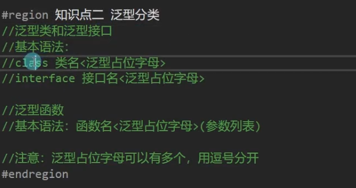

### 3.泛型类和接口

相当于类型占位符的作用


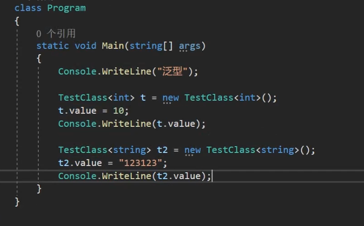

**在声明决定了泛型的类型之后无法再做更改**

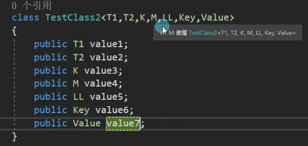

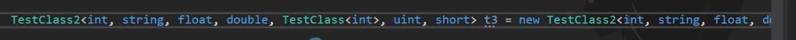

泛型接口：（接口中不能有成员变量但是可以有成员属性）

要继承接口必须实现接口。

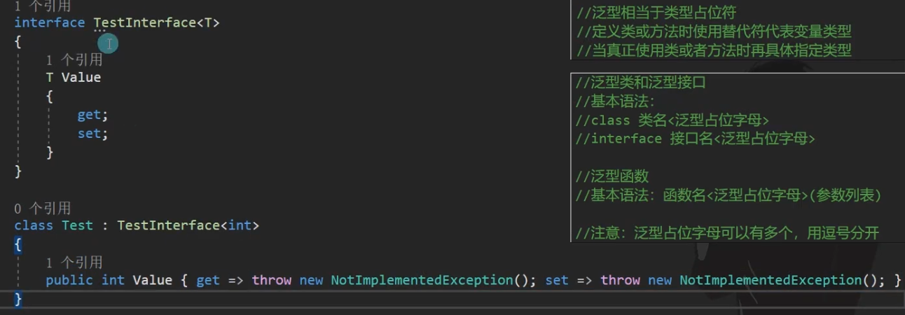

### 4.泛型方法

- 普通类中的泛型方法

  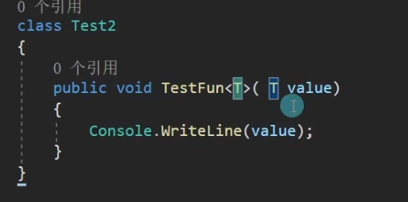

  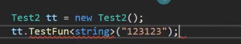

  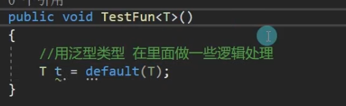

  T的类型是确定的string类型

  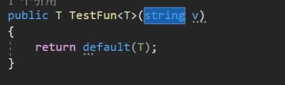

  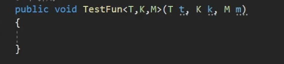

- 泛型类中的泛型方法

​	泛型类和普通类不同，相当于`<T>`也是属于类名称中的一部分

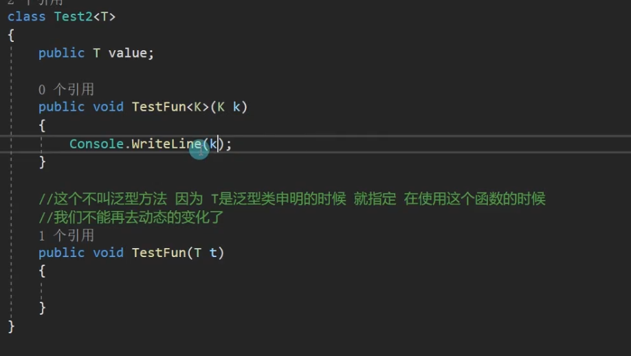

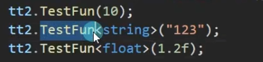

==尖括号<>可以省略掉，可以靠传入的参数确定泛型的具体类型，但不推荐这种写法==

### 5.泛型的作用

- 1.不同类型对象的相同逻辑处理就可以选择泛型
- 2.使用泛型可以一定程度避免装箱拆箱

举例：优化ArrayList
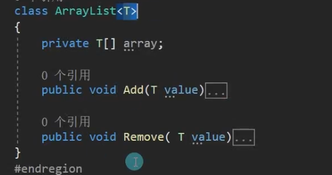

### 总结：

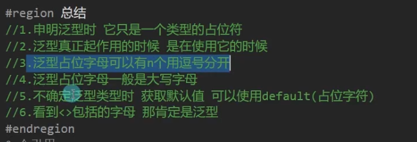

## 泛型约束

### 1.什么是泛型约束

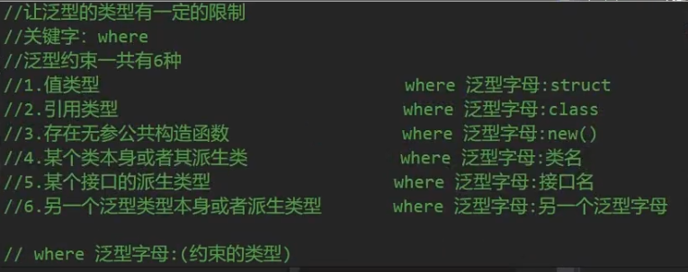

### 2.各泛型约束讲解

- 值类型约束：


- 引用类型约束
  
  

- 公共无参构造函数

  
  

  

  ​	但当泛型类传入int这样的结构体时，**由于结构体的特性是重载有参构造函数不会顶掉默认的无参构造函数，所以可以在这个约束中通过约束条件。**

  ​	==抽象类==也不可以，因为抽象类不能new，不能进行实例化。

- 类约束（约束必须为这个类或者这个类的派生类）

  
  

- 接口约束(某个接口的派生类型)
  
  
  

- 另一个泛型约束（另一个泛型类型本身或者派生类型）

  

### 3.约束的组合使用

```c#
class Test7<T> whereT:class,new()	//不能把new约束写在class约束前面
{
    
}
```

### 4.多个泛型有约束

```c#
class Test8<T,K> where T:class,new() where K:struct
{
    
}
```

### 总结：


# 常用泛型数据结构类

## List（列表）

### 1.List的本质

- List时一个c#为我们封装好的类
- 它的本质是一个可变类型的泛型数组
- List类帮助我们实现了很多方法
- 比如泛型数组的增删查改

### 2.声明

==需要引用命名空间==`using System.Collections.Generic`

```c#
List<int> list = new List<int>();
List<string> list2 = new List<string>();
List<bool> list3 = new List<bool>();
```

### 3.增删查改

- 增


- 删


- 查


- 改


### 4.遍历


### List与ArrayList

List就类似于泛型的ArrayList，两者功能类似，但实际使用中List相对于ArrayList更加方便便捷，==因为ArrayList存在装箱拆箱，并且由于数据存储在万物之父object类当中，所以使用时需要转换相对麻烦==

## Dictionary

### 1.Dictionary的本质

- 可以将Dictionary理解为拥有泛型的Hashtable
- 它也是基于键的哈希代码组织起来的 键/值对
- 键值对类型从Hashtable的object变为了可以为自己指定的泛型

### 2.声明

需要引用命名空间`using System.Collections.Generic`

### 3.增删查改

- 增


- 删


- 查


与hashtable不同的是当查一个不存在的键时，hashtable会返回一个null，而Dictionary则会直接报错


- 改


### 4.遍历

`dictionary.Count`获取当前字典长度，`dictionary.Capacity`获取当前字典的容量


## 😥顺序存储和链式存储


### 1.数据结构

- 数据结构时计算机存储、组织数据的方式（规矩）
- 数据结构是指相互之间存在一种或多种特定关系的数据元素的集合
- 比如自定义的一个类也可以称为一种数据结构，自己定义的数据组合规则
- 不要把数据结构想的太复杂
- 简单点理解，就是人定义的存储数据和表示数据之间关系的规则而已
- 常用的数据结构（前辈总结和制定的一些经典规则）
- ==数组、栈、队列、链表、树、图、堆、散列表==

### 2.线性表

- 线性表是一种数据结构、是由n个具有相同特性的数据元素的有限序列
- 比如数组、ArrayList、Stack、Queue、链表等等
- 顺序存储和链式存储，**是数据结构中两种存储结构**

### 3.==顺序存储==

- 数组、Stack、Queue、List、ArrayList——顺序存储
- 只是数组、Stack、Queue的组织规则不同而已
- 顺序存储：
- 用一组地址连续的存储单元依次存储线性表的各个数据元素

### 4.==链式存储==

相对于**顺序存储**如数组的优点是产生的垃圾比较少，因为是用到一个节点再去新new一个节点，是一个一个节点进行分配而不是像数组那样进行扩容。

- 单向链表、双向链表、循环链表——链式存储
- 链式存储（链接存储）：
- 用一组任意的存储单元存储线性表中的各个数据元素

**单向链表是一个数据只存储指向下一个数据的地址，而双向链表则是指同时存储上一个数据的地址和下一个数据的地址**。

单向链表：


双向链表：


### 5.自己实现一个最简单的单向链表

```c#
using System;

class program
{
    static void Main(string[] args)
    {
        LinkedNode<int> node = new LinkedNode<int>(1);
        LinkedNOde<int> node2 = new LinkedNode<int>(2);
        //实现单线链表传递下一个节点
        node.nextNode = node2;
        //简写
        node2.nextNode = new LinkedNode<int>(3);
        node2.nextNode.nextNode = new LinkedNode<int>(4);
        
    }
}
class LinkedNode<T>
{
    private T value;
    //存储下一个元素是谁  
    public LinkedNode<T> nextNode;
    public LinkedNode(T value)
    {
        this.value = value;
	}
}
//单向链表类管理节点（添加、移除等等）
class LinkedList<T>
{
    public LinkedNode<T> head;
    public LinkedNode<T> last;
    
    public void Add(T value)
    {
        //添加节点 必然是new一个新的节点
        LinkedNode<T> node = new LinkedNode<T>(value);
        if(head == null)
        {
            head = node;
            last = node;
		}
        else
        {
            last.nextNode = node;
            last = node;
        }
	}
    //没有完善移除尾节点时可能会出现的bug
    public void Remove(T value)
    {
        if(head ==null)
        {
            return;
        }
        //object类中的Equals方法用于判断两个引用类型是否相同引用，往往用于比较两个对象是否相等
        if(head.value.Equals(value))
        {
            head = head.nextNOde;
            if(head == null)
            {
                last = null; 
            }
            return;
        }
        LinkedNode<T> node = head;
        while(node.nextNode !=null)
        {
            if(node.nextNode.value.Equals(value))
            {
                //让当前找到的这个元素的上一个节点
                //指向自己的下一个节点
                node.nextNode= node.nextNode.nextNode;
                break;
            }
            //while循环的增量表达式
            node = node.nextNode;
        }
        
    }
}
```

检测封装的Add和Remove方法

```c#
LinkedList<int> link = new LinkedList<int>();
link.Add(1);
link.Add(2);
link.Add(3);
link.Add(4);
LinkedNode<int> node = link.head;
//使用while循环来打印链表
while(node != null)
{
    Console.WriteLine(node.value);
    node = node.nextNode;
    
}
link.Remove(2);
while(node != null)
{
    Console.WriteLine(node.value);
    node = node.nextNode;
    
}
```


### 6.顺序存储和链式存储的优缺点

==从增删查改的角度去思考==

- 增：链式存储计算上优于顺序存储（中间插入时链式不用像顺序存储一样去移动位置）
- 删：链式存储计算上优于顺序存储（中间删除时链式不用像顺序存储一样去移动位置）
- 查：顺序存储使用上优于链式存储（数组可以直接通过下标得到元素，链式需要遍历）
- 改：顺序存储使用上优于链式存储（数组可以直接通过下标得到元素，链式需要遍历）

## Linkedlist（链表）

### 1.LinkedList

- LinkedList时一个c#为我们封装好的类
- 它的本质是一个可变类型的泛型双向链表

### 2.声明

- 需要引用命名空间`using System.Collections.Generic`
- 链表对象 需要掌握两个类
- **一个是链表本身，另一个是链表节点类LinkedListNode**
  

### 3.增删查改

- 增
  

- 删
  

- 查 

  可以通过Find方法去查找节点，并且返回这个节点的引用

  
  如果找不到就返回空（空和null的区别在空是有开辟内存空间，而null没有初始化也没有开辟内存空间)

- 改
  

### 4.遍历


## 泛型栈和队列

### 1.回顾数据容器

变量：


复杂数据容器：


数据集合：


泛型数据集合：

ru

### 2.泛型栈和队列

命名空间：`using System.Collections.Generic;`

**使用上和之前的Stack和Queue一模一样**


# 🤔如何选择使用合适的数据容器


# 委托和事件

## 委托

### 1.委托是什么  

- 委托是函数（方法）的容器
- 可以理解为表示函数（方法）的变量类型
- 用来 存储、传递函数（方法）
- 委托的本质是一个类，用来定义函数（方法）的类型（返回值和参数的类型）
- 不同的函数（方法）必须对应和各自“格式”一致的委托

### 2.基本语法

- 关键字：delegate

- 语法：`访问修饰符 delegate 返回值 委托名（参数列表);`

- 写在哪里：
  可以声明在namespace和class语句块中

  **更多的写在namespace中**

- 简单记忆委托语法，就是函数声明语法前面加一个delegate关键字

### 3.定义自定义委托

- 访问修饰符默认不写，为public 在别的命名空间中也能使用
- private其它命名空间就不能使用了
- 一般使用public
- 委托时支持泛型的，可以让返回值和参数可变，更方便我们的使用

```c#
//声明一个可以用来存储无参无返回值函数的容器 
//这里只是定义了规则 并没有使用
delegate void MyFun();

//表示用来装载或传递，返回值为int 有一个int参数的函数的委托，容器规则
delegate int MyFun(int a);	//这里会报错，委托声明的规则是不能重名（同一语句块中）

```

### 4.使用自定义好的委托

- 委托变量是函数的容器
- 委托常用在：
  1.作为类的成员

​		2.作为函数的参数

**基本使用：**

```c#
class Program
{
    static void Main(string[] args)
    {
        Console.WriteLine("委托");
        //专门用来装载函数的容器
        MyFun f= new MyFun(Fun);
        Console.WriteLine("1");
        Console.WriteLine("2");
        Console.WriteLine("3");
        Console.WriteLine("4");
        /* Invoke写法 */
        //如何调用委托：
        f.Invoke();
       
        /* 直接调用写法*/
        MyFun f2 = Fun;	//是MyFun f = new MyFun(Fun);的简化写法
        Console.WriteLine("1");
        Console.WriteLine("2");
        Console.WriteLine("3");
        Console.WriteLine("4");
        f2();
        
        //有参有返回的函数的委托
        MyFun2 f3 = Fun2;
        Console.WriteLine(f3(1));
        
        MuFun2 f4 = new MyFun2(Fun2);
        Console.WriteLine(f4.Invoke(3));
        
	}
    //必须与委托的形式一致，（返回值和参数）
    static void Fun()
    {	
        Console.WriteLine("123123");
	}
    //有参有返回的函数
    static int Fun2(int value)
    {
        return value;
    }
    static int Fun3()
    {
        Console.WriteLine("这是Fun3");
    }
    
}
```

**常见的使用情景：**

```c#
class Test
{
	public MyFun fun;
	public MyFun2 fun2;
    
    public void TestFun(MyFun fun ,MyFun2 fun2)
    {
        //先处理一些别的逻辑，当这些逻辑处理完了，再执行传入的函数
        int i = 1;
        i *= 2;
        i +=2;
        
        this.fun = fun;
        this.fun2 = fun2;
    }
}
```

```c#
program类的main函数当中
{
    Test t = new Test();
    t.TestFun(Fun,Fun2); 
}
```

### 5.委托变量可以存储多个函数(多播委托)

- 增

  ```c#
  //使用委托存储多个函数
  MyFun ff = Fun;
  ff += Fun;
  ff();
  
  ```

  现在ff对象中存了两个Fun函数，当使用ff时，Fun函数会执行两次

  可以将增的方法封装为一个函数：

  

  

- 删

​	


清空容器后如果直接调用会报错。

### 6.系统定义好的委托

系统自带Action委托，使用需要在`using System`命名空间中


泛型委托：

==Func<>==


**系统提供的可以传n个参数的委托**：


  

### 总结：


## 事件

### 1.事件是什么

- 事件是基于委托的存在
- 事件是委托的安全包裹
- 让委托的使用更具有安全性
- 事件是一种特殊的变量类型

### 2.事件的使用


==不能在类外部赋值==

==不能在类外部进行调用==

```c#
class Test
{
    //系统声明好的委托
    //委托成员变量，用于存储函数的
    public Action myFun;
    //事件成员变量，用来存储函数的
    public event Action myEvent;
    
    public Test()
    {
        //事件的使用和委托一模一样，只有一些细微的区别
        myFun = TestFun;
        myFun +=TestFun;
        myFun -= TestFun;
        myFun();
        myFun.Invoke();
        myFun = null;
        
        
        myEvent = TestFun;
        myEvent +=TestFun;
        myEvent -= TestFun;
        myEvent();
        myEvent.Invoke();
        myEvent = null;
        
    }
    
    public void TestFun()
    {
        Console.WriteLine("123");       
	}
    
}
```


**要在外部调用事件必须要在类内部去封装好方法调用**


### 3.为什么有事件

**1.防止外部随意置空委托**

**2.防止外部随意调用委托**

**3.事件相当于对委托进行了一次封装，让其更加安全**

## 总结


## 匿名函数

### 1.什么是匿名函数

- 顾名思义，就是没有名字的函数
- 匿名函数的使用主要是配合委托和事件进行使用
- 脱离委托和事件，是不会使用匿名函数的

### 2.基本语法


### 3.使用

#### 1.无参无返回：


#### 2.有参：


#### 3.有返回值：

delegate前面不需要加上返回值类型，可以根据return的数据自动判断类型


**在控制台中输出123123**

#### 4.一般情况下会作为函数参数传递或者作为函数返回值


 参数传递👆

#### 返回值

用匿名函数代替函数返回值


调用：


### 4.匿名函数的缺点

==添加到委托或事件容器中后，不记录，无法单独移除==


此匿名函数非彼匿名函数，不能通过看逻辑是否一样，就证明是一个

只能通过清空委托来清楚匿名函数。

`ac3 = null;`

###  总结：


## Lambad表达式

### 1.什么是lambad表达式

- 可以将lambad表达式，理解为==匿名函数的简写==
- 它除了写法不同外
- 使用上和匿名函数一模一样
- 都是和委托或者事件 配合使用的

### 2.lambad表达式语法


### 3.使用

#### （1）.无参无返回

```c#
Action a = () =>
{
    Console.WriteLine("无参无返回值的lambad表达式")
};
a();
```

#### （2）.有参

```c#
Action<int> a2 = (int value) =>
{
	Console.WriteLine("有参数Lambad表达式{0}",value);
};	//主要要写分号 ，因为本质是一个赋值语句
a2(100);
```

#### （3）.甚至参数类型都可以省略，参数类型和委托或事件容器一致

```c#
Action<int> a3 = (value) =>
{
    Console.WriteLine("省略参数类型的写法{0}",value);
};
a3(200);
```

#### （4）.有返回值

```c#
//Func是系统自定义的带有返回值的泛型委托
Func<string,int> a4 = (value) =>
{
    Console.WriteLine("有返回值有参数的lambad表达式",value);
    return 1;
};
Console.WriteLine(a4("123123"));
```

**其它传参使用等和匿名函数一样**

**缺点也是和匿名函数一样**

### 4.闭包

- 内层的函数可以引用包含在它外层的函数的变量
- 即使外层函数的执行已经终止
- 注意：
- ==该变量提供的值并非变量创建时的值，而是在父函数范围内的最终值==

```c#
class Test
{
    public event Action action;
    
    public Test()
    {
        int value = 10;
        //这里形成了闭包
        //因为当构造函数执行完毕时，其中声明的临时变量value的生命周期被改变了，因为它被action变量占用着
        action = () =>
        {
            Console.WriteLine(value);
        };
        //该变量提供的值并非变量创建时的值，而是在父函数范围内的最终值
        for(int i =0; i<10; i++)
        {
            action += () =>
            {
                //最终打印的值不是传入的值而是最终停止循环后的值，因为实际传的是i这个形参的引用，当调用委托时，才确定了具体的值进行打印
                Console.WriteLine(i);
			};
        }
        }
	}
    public void DoSomthing()
    {
        action();
	}
}
```

**要实现依次打印for循环的自增变量：**

```c#
for(int i = 0; i<10; i++)
{
    //每次循环index都是一个新的变量，此index非彼index
    int index = i;
    action += () =>
    {
        //循环10次，10个临时变量index
        Console.WriteLine(index);
    };
}
```

主函数中进行调用:`Test t = new Test();``t.DoSomthing();`

### 总结：


# List排序

引用命名空间`using System.Collections.GEneric;`

## 1.List自带排序方法


**ArrayList**中也有对应的Sort排序方法

## 2.自定义类的排序

```c#
class Item
{
	public int money;
	public Item(int money)
	{
		this.money = money;
	}
}
```

想要直接对自定义类进行排序会报错：


 **int能够通过Sort方法进行排序是因为int类中定义了排序相关的方法，但在自定义类中没有这样的方法**

让自定义类Item继承有排序方法的接口，注意：需要引用命名空间


是使用接口中的规则进行return判断来进行排序的。

## 3.通过委托函数进行排序

```c#
class ShopItem
{
    public int id;
    public ShopItem(int id)
    {
        this.id = id;
    }
}
```


 

使用匿名函数的写法或者lambad表达式的写法


Lambad表达式写法：

使用三目运算符进一步简写


### 总结：


# 协变逆变

## 1.什么是协变逆变

- **协变：**

- 和谐的变化，自然的变化

- 因为里氏替换原则，父类可以装子类

- 所以子类变父类

- 比如string 变成 object

- 感受是和谐的

  ---

  

- **逆变：**

- 逆常规的变化，不正常的变化

- 因为 里氏替换原则 父类可以装子类，但是子类不能装父类

- 所以 父类变子类

- 比如object 变成 string 

- 感受是不和谐的

  ---

- 协变和逆变是用来修饰泛型的

- 协变：out

- 逆变：in

- 用于在泛型中 修饰 泛型字母的

- 只有泛型接口和泛型委托能使用

## 2.作用

- (1).返回值和参数

  - 用out修饰的泛型，只能作为返回值
    `delegate T TestOut<out T>();`

  - 用in修饰的泛型，只能作为参数

    `delegate void TestIn<in T>(T t);`

    ```c#
    interface Test<out T>
    {
    	T TestFun();
    }
    
    ```

- (2).作用（结合里氏替换原则讲解） 

  		## 总结：

# 多线程

## 1.了解线程前先了解进程

- 进程（Process）是计算机中的程序关于某数据集合上的一次运行活动
- 是系统进行资源分配和调度的基本单位，是操作系统结构的基础
- 打开一个应用程序就是在操作系统上开启了一个进程
- 进程之间可以相互独立运行、互不干扰
- 进程之间也可以相互访问、操作


## 2.什么是线程


- 操作系统能够进行运算调度的最小单位
- 它被包含在进程之内，是进程中的实际运作单位
- 一条线程指的是进程中一个单一顺序的控制流，一个进程可以并发多个线程
- 我们目前写的程序，都在主线程中
- 简单理解线程：
- 就是代码从上到下运行的一条管道   

## 3.什么是多线程


- 我们可以通过代码，开启新的线程
- 可以同时运行代码的多条管道，就叫多线程

## 4.语法相关


==重看视频==


## 5.线程之间共享数据

- 多个线程使用的内存是共享的，都属于该应用程序（进程）
- 所以要注意，当多线程同时操作同一片内存区域可能会出问题
- 可以通过加锁的形式避免问题

**解决的方法：**


**lock后的语句一定是引用类型**

## 6.多线程对于我们的意义

- 可以用多线程专门处理一些复杂耗时的逻辑
- 比如：寻路、网络通信等等

## 总结：


# 预处理指令

## 1.什么是编译器

- 编译器是一种翻译程序
- 它用于将源语言程序翻译为目标语言程序
- 源语言程序：某种程序设计语言写成的，比如c#、c、c++、Java等语言写的程序
- 目标语言程序：二进制数表示的伪机器代码写的程序

## 2.什么是预处理器指令

- 预处理器指令，指导编译器，在实际编译开始之前对信息进行预处理
- 预处理器指令，都是以#开始
- 预处理器指令不是语句，所以它们不是以分号；结束
- 目前我们经常用到的，折叠代码块，就是预处理器指令

## 3.常见的预处理器指令


#error：


# 反射和特性

### 1.什么是程序集

- 程序集是经由编译器编译得到的，供进一步编译执行的那个中间产物
- 在WINDOWS系统中，它一般表现为后缀为.dll（库文件）或者是.exe（可执行文件）的格式
- 程序集就是我们写的一个代码集合，我们现在写的所有代码，最终都会被编译器翻译为一个程序集供别人使用，比如一个代码库文件（dll）或者一个可执行文件（exe）

### 2.元数据

- 元数据就是用来描述数据的数据
- 这个概念不仅仅用于程序上，在别的领域也有元数据
- 程序中的类，类中的函数、变量等等信息就是程序的元数据
- 有关程序以及类型的数据被称为元数据，它们保存在程序集中

### 3.反射的概念

- 程序正在运行时，可以查看其它程序集或者自身的元数据。
- 一个运行的程序查看本身或者其它程序的元数据的行为就叫做反射
- 在程序运行时，通过反射可以的到其它程序集或者自己程序集代码的各种信息
- 类，函数，变量，对象等等，实例化它们，执行它们，操作它们 

### 4.反射的作用


### 5.语法相关

```c#
class Test
{
	private int i =1;
	public int j=0;
	public string str="123";
	public Test()
	{
	
	}
    public Test(int i)
    {
        this.i = i;
       
	}
    public Test(int i,string str):this(i)
    {
        this.str = str;
    }
    public void Speak()
    {
        Console.WriteLine(i);
    }
}
```


三种方式得到的type，实际指向的都是同一个堆中的地址——每一个类型的type都是唯一的。

---


---

 

---


---


---


---

其它：


---

**Type：**

---

**Assembly**:

---

**Activator:**


---

## 特性：

### 1.特性是什么


### 2.自定义特性


### 3.特性的使用

### 4.限制自定义特性的使用范围

### 5.系统自带特性——过时特性

### 6.系统自带特性——调用者信息特性

### 7.系统自带特性——条件编译特性

### 8.系统自带特性——外部Dll包函数特性


# 迭代器

## 1.迭代器是什么


## 2.标准迭代器的实现方法

 

## 3.用yield return 语法糖实现迭代器

## 4.用yield return 语法糖为泛型类实现迭代器

# 特殊语法

# 排序进阶