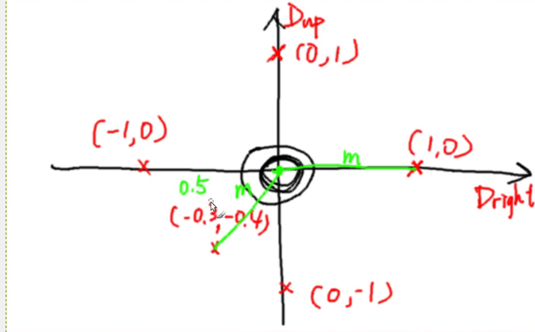
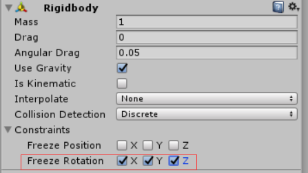
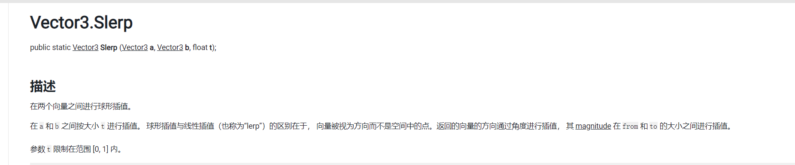
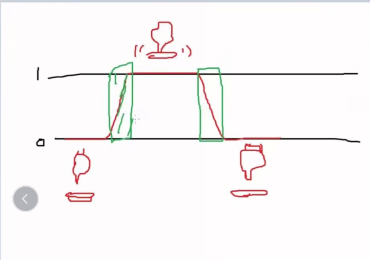

# 07-08、角色行走

- 要解决角色在后退时，**forward**值为负数无法传递进animator中的问题，解决思路如下：
  

即使用点到点之间的距离来设定forward值。

核心代码：

```c#
Dmag = Mathf.Sqrt((Dup * Dup) + (Dright * Dright));
Dvec = Dright/*/存量/*/ * transform.right/*/向量/*/ + Dup * transform.forward;	//model.transform.forward 获得capsule的朝向。将一个矢量值传入forward属性中。
```

Dmag用于确定传入aniamtor中forward的值，Dvec用于确定capsule朝向的三维向量。

随后在update中调用：

```c#
void Update()
	{
		anim.SetFloat("forward", pi.Dmag);
		model.transform.forward = pi.Dvec;	
	}
```

---

**纠错修改代码：**

```c#
if(pi.Dmag > 0.1f) //保证人物在松开按键的情况下朝向不会归零
        {
			model.transform.forward = pi.Dvec;
		}
		
```


**人物向前移动代码：**

```c#
 void Update()	//两帧间隔时Time.DeltaTime 1/60
	{
		anim.SetFloat("forward", pi.Dmag);

		if(pi.Dmag > 0.1f) //保证人物在松开按键的情况下朝向不会归零
        {
			model.transform.forward = pi.Dvec;
		}
		movingVec = pi.Dmag/*/存量/*/ * model.transform.forward/*/向量/*/;
		


	}

	void FixedUpdate()	//物理引擎更新,两帧间隔为Time.fixedDeltaTime 1/50
    {
		rigid.position += movingVec * Time.fixedDeltaTime;

    }
```

要注意的是使用rigidbody控制人物移动时，当左右移动时可能会产生小的rotation角，在重力的作用下会导致人物翻转或倒在地上，所以在使用rigidbody控制人物移动时需要把x、y、z轴锁定



 **适配角色移动速度与动画播放速度**

定义一个walkSpeed来控制人物的移动速度，因为动画的播放速度时默认的

```c#
rigid.position += movingVec * Time.fixedDeltaTime * walkSpeed;
```

**使移动向量不控制y轴的向量**

```c#
void FixedUpdate()	//物理引擎更新,两帧间隔为Time.fixedDeltaTime 1/50
    {
		/*rigid.position += movingVec * Time.fixedDeltaTime * walkSpeed;*/    //直接指派位置，所以需要乘以时间
		//Or rigid.velocity = movingVec; 直接指派速度
		rigid.velocity = new Vector3(movingVec.x, rigid.velocity.y, movingVec.z);	//指派y轴的分量不让movingVec改写它

    }
```

# 09、角色奔跑

**核心代码：**

`movingVec = pi.Dmag/*/存量/*/ * model.transform.forward/*/向量/*/ * walkSpeed * ((pi.run) ? 2.0f : 1.0f);`

run在PlayerInputs中定义为一个bool值变量

出现的问题：斜线跑的速度会变成1.414倍，特别在奔跑的情况下这个速度会被放大。

---

# 010、线性插值与球形线性插值（缓动旋转和走路和跑步之间的缓动）

`Vector3 targetForward = Vector3.Slerp(model.transform.forward, pi.Dvec, 0.5f);`



`anim.SetFloat("forward", pi.Dmag * Mathf.Lerp(anim.GetFloat("forward"), ((pi.run) ? 2.0f : 1.0f), 0.5f));`

---

# 011、椭圆映射法（解决斜向移动奔跑的问题）

**核心代码：**

```c#
private Vector2 SquareToCircle(Vector2 input)
    {
		Vector2 output = Vector2.zero;
		output.x = input.x * Mathf.Sqrt(1 - (input.y * input.y) / 2.0f);	//使用椭圆映射的方法将二维坐标系转化为椭圆坐标系
		output.y = input.y * Mathf.Sqrt(1 - (input.y * input.y) / 2.0f);

		return output;
    }
```

随缘看懂了，调用部分的代码：

```c#
		Vector2 tempAxis = SquareToCircle(new Vector2(Dright, Dup));
		float Dright2 = tempAxis.x;
		float Dup2 = tempAxis.y;

		Dmag = Mathf.Sqrt((Dup2 * Dup2) + (Dright2 * Dright2));
        Dvec = Dright2/*/存量/*/ * transform.right/*/向量/*/ + Dup2 * transform.forward;  //model.transform.forward 获得capsule的朝向。将一个矢量值传入forward属性中。
		run = Input.GetKey(keyA);
```

---

# 012-13、一次性触发控制（实现跳跃功能）、加入跳跃动画



核心代码：

```c#
		bool newJump = Input.GetKey(keyB);
        //jump = tempJump;
        if (newJump != lastJump)
        {
			jump = true;
			print("jump trigger!!");

        }
		else
        {
			jump = false;
        }
		lastJump = newJump;
```

在actorcontroller类中：

```c#
	if (pi.jump)
        {
			anim.SetTrigger("jump");	//实现PlayerInputs类中参数的传递

		}
```

