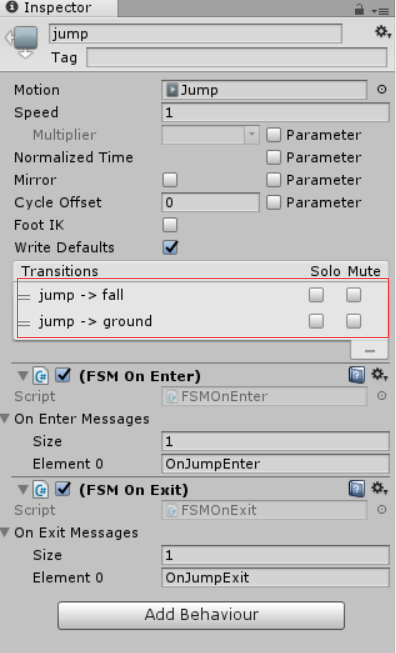
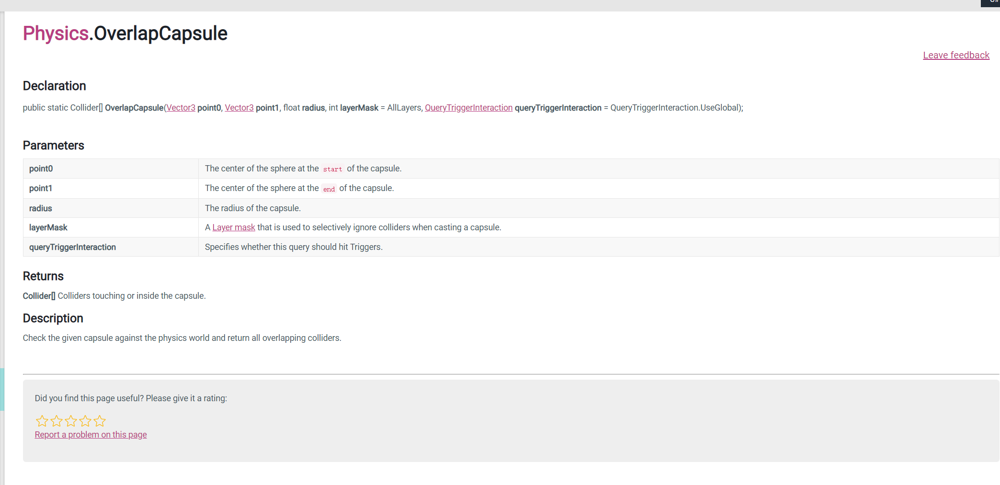
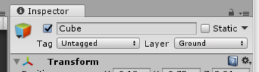

# 018、新增降落状态

调换动画播放的顺序：



---

# 019-20、落地检测器

**应用的脚本API**：


核心代码：

```c#
using System.Collections;
using System.Collections.Generic;
using UnityEngine;

public class OnGroundSensor : MonoBehaviour {


	public CapsuleCollider capcol;
	private Vector3 point1;
	private Vector3 point2;
	private float radius;

	
	void Awake () {
		radius = capcol.radius;
		

        
	}
	
	// Update is called once per frame
	void Update () {
		
	}
	void FixedUpdate()
	{

		point1 = transform.position + transform.up * radius;
		point2 = transform.position + transform.up * capcol.height - transform.up * radius;

		Collider[] outputCols = Physics.OverlapCapsule(point1, point2, radius,LayerMask.GetMask("Ground"));
		if (outputCols.Length != 0)
		{   //检测碰撞（需复习）
			foreach (var col in outputCols)
			{
				print("collision"+col.name);

			}
		}
	}

}

```

同时为plane和cube设置Ground **layer**：



```c#
	 void FixedUpdate()
    {

        point1 = transform.position + transform.up * radius;
        point2 = transform.position + transform.up * capcol.height - transform.up * radius;

        Collider[] outputCols = Physics.OverlapCapsule(point1, point2, radius, LayerMask.GetMask("Ground"));
        if (outputCols.Length != 0)
        {   //检测碰撞（需复习）
            //foreach (var col in outputCols)
            //{
            //    //print("collision" + col.name);

            SendMessageUpwards("IsGround");

            //}
           
        }
        else
        {
            SendMessageUpwards("IsNotGround");
        }
    }
```

```c#
	 public void IsGround()
    {
        print("is on ground");
    }
    public void IsNotGround()
    {
        print("is not on ground");
    }
```

