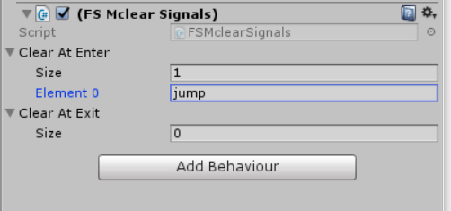
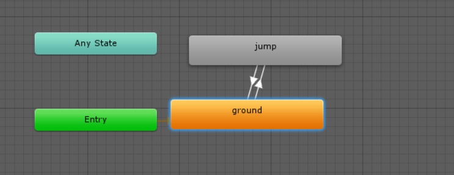

# 014-15、重置动画控制器触发（解决连按两下动画也连续播放不赞停的问题）、套接出FSM On Enter&Exit方法

核心代码：

```c#
using System.Collections;
using System.Collections.Generic;
using UnityEngine;

public class FSMclearSignals : StateMachineBehaviour {

	public string[] clearAtEnter;	//声明两个数组存放动画
	public string[] clearAtExit;

    public override void OnStateEnter(Animator animator, AnimatorStateInfo stateInfo, int layerIndex)	//当进入动画时执行
    {
        foreach (var signal in clearAtEnter)
        {
            animator.ResetTrigger(signal);

        }
    }
    public override void OnStateExit(Animator animator, AnimatorStateInfo stateInfo, int layerIndex)
    {
        foreach(var signal in clearAtExit)
        {
            animator.ResetTrigger(signal);
        }
    }
}

```

上述代码的效果是当人物在进入ground状态时，会立刻重置传入的jump动作的值。





---

```c#
 override public void OnStateEnter(Animator animator, AnimatorStateInfo stateInfo, int layerIndex)
    {
        foreach (var msg in onEnterMessages)    //这个方法能够将信息传给animator这个组件中的gameobject传递信息，而这个gameobject上挂载了一个TesteFsMOnEnter.cs的类，类中存在一个Onjump的方法，而sendMessage通过数组的名字呼叫了那个方法
        {
            animator.gameObject.SendMessage(msg);
        }
    }

```

```c#
public string[] onExitMessages;
    // OnStateEnter is called when a transition starts and the state machine starts to evaluate this state
    //override public void OnStateEnter(Animator animator, AnimatorStateInfo stateInfo, int layerIndex) {
    //
    //}

    // OnStateUpdate is called on each Update frame between OnStateEnter and OnStateExit callbacks
    //override public void OnStateUpdate(Animator animator, AnimatorStateInfo stateInfo, int layerIndex) {
    //
    //}

    // OnStateExit is called when a transition ends and the state machine finishes evaluating this state
    override public void OnStateExit(Animator animator, AnimatorStateInfo stateInfo, int layerIndex)
    {
        foreach (var msg in onExitMessages)
        {
            animator.gameObject.SendMessageUpwards(msg);
        }

    }

```


```c#
public void OnJumpEnter()
    {
        print("On Jump Enter");

    }
public void OnJumpExit()
{
    print("On Jump Exit");
}
```

---

# 016-017、锁死平面移动(为跳跃保留水平的冲量)、跳跃冲量（赋予角色跳跃的冲量使其飞起来）

`				if (lockPlanar ==  false)   //当跳跃的时候会使lockPlanar锁死，即跳跃的时侯无法在空中进行移动
        {
            planarVec = pi.Dmag/*/存量/*/ * model.transform.forward/*/向量/*/ * walkSpeed * ((pi.run) ? runMultiplier : 1.0f);
        }`


赋予跳跃冲量核心代码:

```c#
	public void OnJumpEnter()
    {
        pi.inputEnabled = false;
        lockPlanar = true;
        thrustVec = new Vector3(0, jumpVelocity, 0);

    }
```

在fixedupdate中实现:

```c#
	void FixedUpdate()	//物理引擎更新,两帧间隔为Time.fixedDeltaTime 1/50
    {
        /*rigid.position += planarVec * Time.fixedDeltaTime * walkSpeed;*/    //直接指派位置，所以需要乘以时间
                                                                              //Or rigid.velocity = planarVec; 直接指派速度
        rigid.velocity = new Vector3(planarVec.x, rigid.velocity.y, planarVec.z) + thrustVec;	//指派y轴的分量不让planarVec改写它
        thrustVec = Vector3.zero;
    }
```

