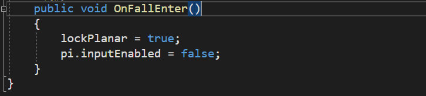
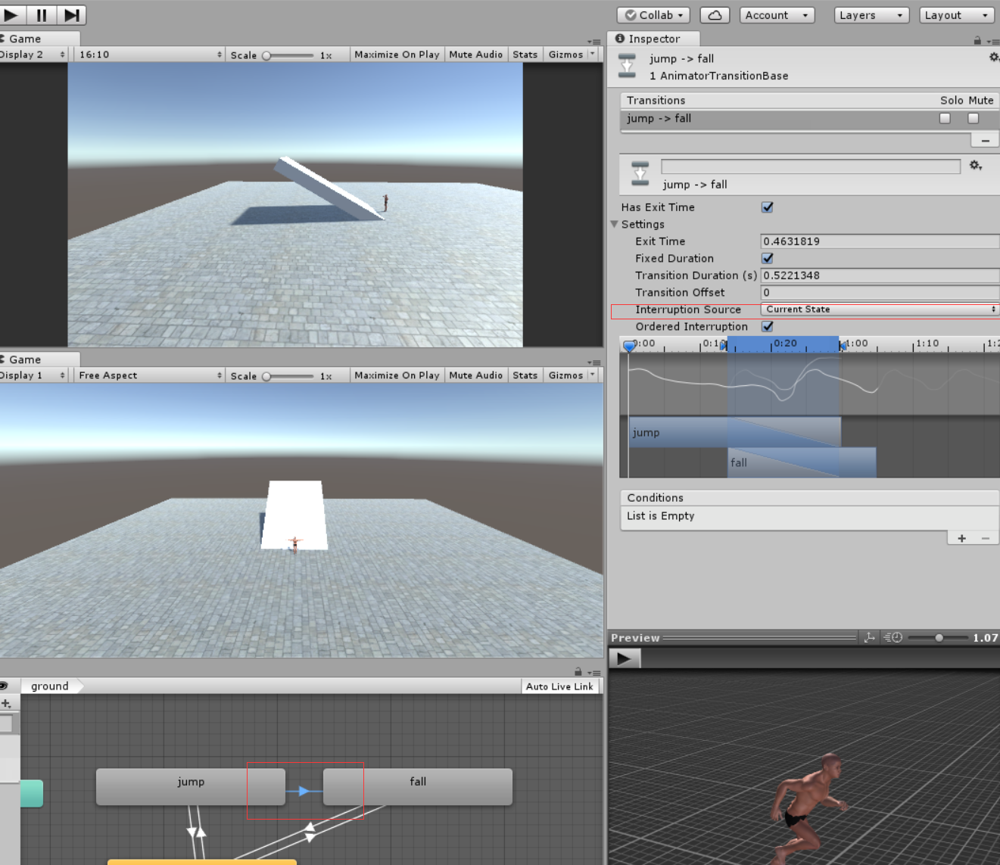

# 021、重新修整降落状态（修复下落失速的问题）

---

# 022、失足掉落

从ground动画状态到fall的动画状态

失足掉落时要锁死移动和保持前进的分量，如果不这么做的话人物在移动到悬崖的地方下落会直直的下落而没有抛物线的效果

== 即使修改了jump动画转fall和转ground的优先级，但是当实际动画发生的时候已经进入了jump——>fall的箭头之中，这时候会导致只是在平面上跳跃也会播放fall的动画，要解决整个问题需要将Interruption Source修改为Current State

