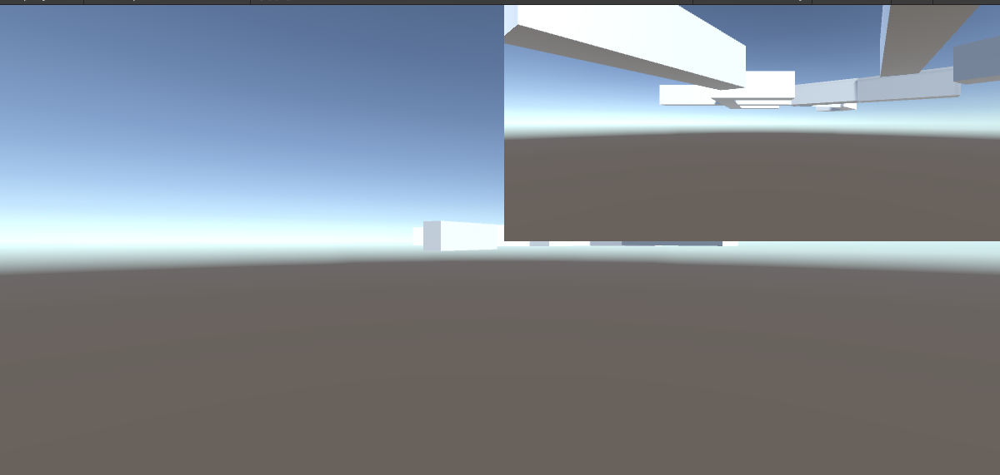

# 快捷键

- 按住v可以吸附网格点

- 按t可以单边拉伸形变

- 按r是两端形变

- 按e进入旋转模式，按住ctrl进行旋转可以每隔15°进行旋转

- ctrl+shift+f 使选中的物体移动到当前摄像机视角的位置

---

- 开发模式使用2by3视图，并且可以创建多个窗口，为相机指定显示器的角度。

- 在unity中如果同时存在多个摄像机，那么摄像机的显示优先度是按照深度来的：

maincamera的默认深度是-1

而新建的camera的默认深度往往是0，所以新建的camera会直接覆盖maincamera

- 使用ViewPort Rect属性使同一个窗口中出现两个摄像机进行调试：

- 当使用Free Aspect时，摄像机会随着视窗的压缩而压缩，并不利于视角的固定，因此应该选择16：9或固定分辨率

- unity美术的流程一般是：在三维软件中完成建模，随后在三维软件中展好uv，随后将uv图导出到ps等软件中，在绘图软件中完成贴图的制作后重新回到建模软件中，此时贴图已经会显现在建模软件中，再将白模fbx等格式导入到unity中，随后再将贴图直接拖动到模型中，unity会自动生成相应的材质球。

- 在project setting中找到shadow distance来调整阴影可见距离。
- animator如果涉及到位置变换，则需要将animator放在子物体上。

- timeline时间线用于简单处理多个动画的播放顺序。
- 区分animator、animation、animator controller，其中animator是作为insepect中的组件存在，并且具有预制件，能够同时处理多个动画，而animation只是其中的一段动画，animator controller则是用于控制动画切换的状态机。

---

- unity中的lod是用于节省场景资源对编辑器占用的一种优化手段。
- 在使用terrain刷地形贴图时，可以给地形贴图加上对应的法线贴图。
- 使用unity中的postprocess组件进行后期处理
- 使用Occlusion Volumes（遮挡剔除）进一步优化unity场景资源占用的编辑器资源。

---

- 多边形建模，材质贴图纹理导出工作流。
- unity导入动画路径。

---

# unity帧率控制

设置了垂直同步强制游戏的运行帧率为60帧，而在states中显示的帧数是在高性能的显卡的影响下显示的帧数，与实际运行时的帧数无关。